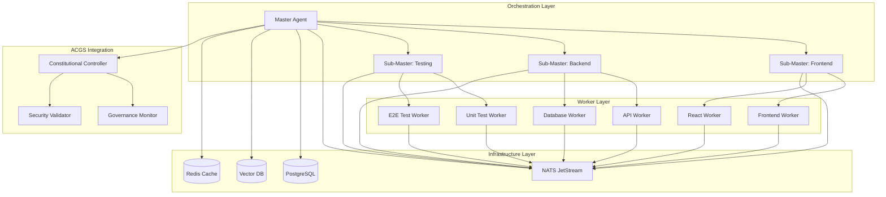
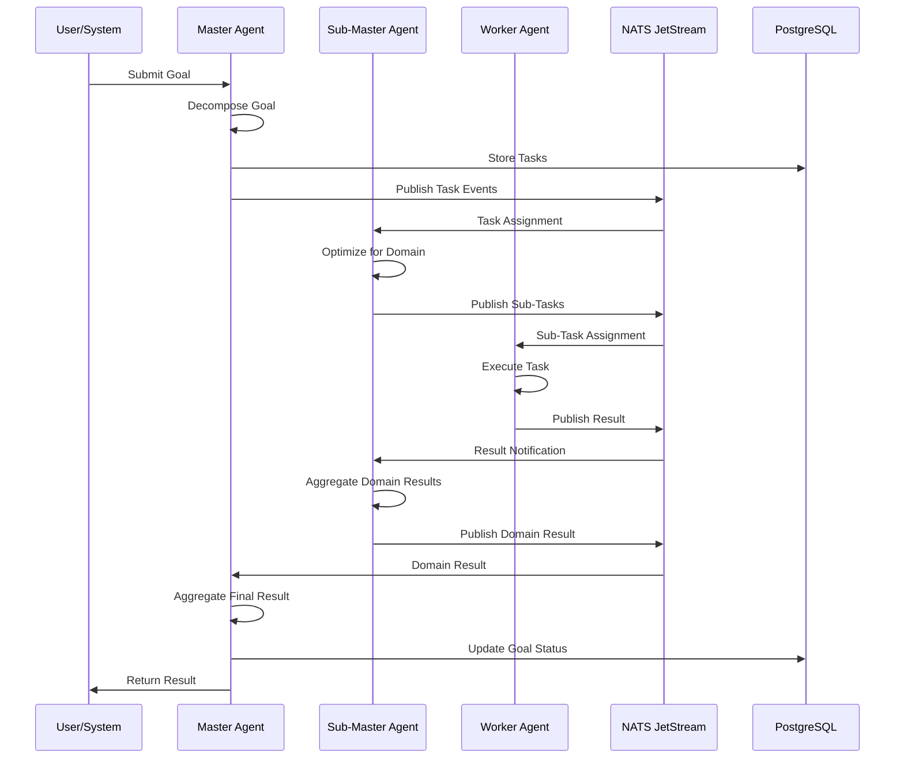

# Multi-Agent DGM Orchestration Platform - Architectural Specification

**Document Version:** 1.0  
**Date:** June 2, 2025  
**Architect:** Roo Code Assistant  
**System:** Darwin Gödel Machine Multi-Agent Platform  

## Executive Summary

This document presents the comprehensive architecture for transforming the current single-agent DGM system into a production-ready multi-agent orchestration platform. The design implements a hierarchical agent coordination system optimized for scalability, maintainability, and integration with the existing ACGS framework.

## Table of Contents

1. [Architecture Overview](#1-architecture-overview)
2. [Component Architecture](#2-component-architecture)
3. [Data Flow & Communication](#3-data-flow--communication)
4. [API Specifications](#4-api-specifications)
5. [Database Schema](#5-database-schema)
6. [Integration Patterns](#6-integration-patterns)
7. [Security & Governance](#7-security--governance)
8. [Deployment Architecture](#8-deployment-architecture)
9. [Monitoring & Health](#9-monitoring--health)
10. [Implementation Roadmap](#10-implementation-roadmap)

---

## 1. Architecture Overview

### 1.1 Design Principles

- **Hierarchical Coordination**: Master agents orchestrate specialized worker agents
- **Lightweight Infrastructure**: Minimal overhead using proven technologies
- **Domain Specialization**: Workers specialized by technology and function
- **Scalable Messaging**: Event-driven architecture with reliable messaging
- **Fault Tolerance**: Robust error handling and recovery mechanisms
- **ACGS Integration**: Deep integration with constitutional governance

### 1.2 High-Level Architecture



### 1.3 Core Components

| Component | Purpose | Technology | Scale |
|-----------|---------|------------|-------|
| Master Agent | Task orchestration & coordination | Python/FastAPI | 1-3 instances |
| Sub-Master Agents | Domain-specific coordination | Python/FastAPI | 3-10 instances |
| Worker Agents | Specialized task execution | Python/Docker | 10-100 instances |
| Message Broker | Reliable task distribution | NATS JetStream | 3-node cluster |
| State Store | Persistent task & agent state | PostgreSQL | HA cluster |
| Vector DB | Code knowledge & context | ChromaDB/FAISS | Single instance |
| Cache Layer | Performance optimization | Redis | 3-node cluster |

---

## 2. Component Architecture

### 2.1 Master Agent Architecture

```python
# Core Master Agent Structure
class MasterAgent:
    """
    Orchestrates the entire multi-agent system
    - Goal decomposition and task planning
    - Agent lifecycle management
    - Result aggregation and validation
    - ACGS constitutional compliance
    """
    
    def __init__(self):
        self.task_decomposer = TaskDecomposer()
        self.agent_manager = AgentLifecycleManager()
        self.result_aggregator = ResultAggregator()
        self.constitutional_monitor = ConstitutionalMonitor()
        self.health_monitor = HealthMonitor()
    
    async def decompose_goal(self, goal: Goal) -> List[Task]:
        """Break down high-level goals into executable tasks"""
        
    async def allocate_tasks(self, tasks: List[Task]) -> Dict[str, Task]:
        """Intelligently allocate tasks to appropriate agents"""
        
    async def monitor_execution(self) -> ExecutionStatus:
        """Monitor and coordinate task execution"""
        
    async def aggregate_results(self, results: List[TaskResult]) -> GoalResult:
        """Combine and validate task results"""
```

#### 2.1.1 Task Decomposition Engine

```python
class TaskDecomposer:
    """
    Intelligent task breakdown using DGM principles
    """
    
    def __init__(self):
        self.llm_service = LLMService()
        self.knowledge_base = CodeKnowledgeBase()
        self.dependency_analyzer = DependencyAnalyzer()
    
    async def decompose(self, goal: Goal) -> DecompositionResult:
        """
        Break down goals into actionable tasks with dependencies
        """
        # Analyze goal complexity and domain
        complexity = await self.analyze_complexity(goal)
        domains = await self.identify_domains(goal)
        
        # Generate task breakdown using LLM
        prompt = self.create_decomposition_prompt(goal, complexity, domains)
        raw_tasks = await self.llm_service.generate_tasks(prompt)
        
        # Validate and structure tasks
        tasks = await self.structure_tasks(raw_tasks)
        
        # Analyze dependencies
        dependencies = await self.dependency_analyzer.analyze(tasks)
        
        return DecompositionResult(
            tasks=tasks,
            dependencies=dependencies,
            estimated_complexity=complexity,
            domains=domains
        )
```

#### 2.1.2 Agent Lifecycle Manager

```python
class AgentLifecycleManager:
    """
    Manages the lifecycle of all agents in the system
    """
    
    def __init__(self):
        self.agent_registry = AgentRegistry()
        self.resource_allocator = ResourceAllocator()
        self.scaling_controller = AutoScalingController()
    
    async def provision_agent(self, agent_spec: AgentSpec) -> Agent:
        """Provision new agent instances based on demand"""
        
    async def terminate_agent(self, agent_id: str) -> bool:
        """Gracefully terminate agent instances"""
        
    async def scale_agents(self, domain: str, target_count: int) -> ScalingResult:
        """Auto-scale agents based on workload"""
        
    async def health_check_all(self) -> Dict[str, HealthStatus]:
        """Comprehensive health check of all agents"""
```

### 2.2 Sub-Master Agent Architecture

```python
class SubMasterAgent:
    """
    Domain-specific coordination agent
    - Manages workers in specific domains
    - Performs domain-specific task optimization
    - Handles domain expertise and context
    """
    
    def __init__(self, domain: str):
        self.domain = domain
        self.worker_pool = WorkerPool(domain)
        self.domain_optimizer = DomainOptimizer(domain)
        self.context_manager = DomainContextManager(domain)
    
    async def optimize_tasks(self, tasks: List[Task]) -> List[OptimizedTask]:
        """Apply domain-specific optimizations to tasks"""
        
    async def allocate_to_workers(self, tasks: List[Task]) -> Dict[str, Task]:
        """Intelligently allocate tasks to domain workers"""
        
    async def coordinate_execution(self) -> CoordinationResult:
        """Coordinate execution across domain workers"""
```

### 2.3 Worker Agent Architecture

```python
class WorkerAgent:
    """
    Specialized execution agent
    - Executes specific types of tasks
    - Maintains domain expertise
    - Reports results and status
    """
    
    def __init__(self, specialization: str):
        self.specialization = specialization
        self.execution_engine = SpecializedExecutionEngine(specialization)
        self.context_retriever = ContextRetriever()
        self.result_validator = ResultValidator()
    
    async def execute_task(self, task: Task) -> TaskResult:
        """Execute a specialized task"""
        
    async def request_context(self, context_request: ContextRequest) -> Context:
        """Request additional context for task execution"""
        
    async def validate_result(self, result: TaskResult) -> ValidationResult:
        """Validate task execution result"""
```

---

## 3. Data Flow & Communication

### 3.1 Message Flow Architecture



### 3.2 NATS JetStream Configuration

```yaml
# NATS JetStream Streams Configuration
streams:
  - name: "tasks"
    subjects: ["tasks.>"]
    storage: "file"
    retention: "workqueue"
    max_msgs: 10000
    max_bytes: 1GB
    max_age: "24h"
    
  - name: "results"
    subjects: ["results.>"]
    storage: "file"
    retention: "limits"
    max_msgs: 50000
    max_bytes: 5GB
    max_age: "7d"
    
  - name: "health"
    subjects: ["health.>"]
    storage: "memory"
    retention: "limits"
    max_msgs: 1000
    max_age: "1h"
    
  - name: "context"
    subjects: ["context.>"]
    storage: "file"
    retention: "workqueue"
    max_msgs: 5000
    max_bytes: 500MB
    max_age: "4h"

# Consumer Configuration
consumers:
  - stream: "tasks"
    name: "master-task-consumer"
    durable: true
    ack_policy: "explicit"
    max_deliver: 3
    
  - stream: "tasks"
    name: "sub-master-task-consumer"
    durable: true
    filter_subject: "tasks.domain.*"
    ack_policy: "explicit"
    max_deliver: 3
    
  - stream: "tasks"
    name: "worker-task-consumer"
    durable: true
    filter_subject: "tasks.worker.*"
    ack_policy: "explicit"
    max_deliver: 5
```

### 3.3 Message Schemas

```python
# Core message schemas for inter-agent communication

@dataclass
class TaskMessage:
    """Task assignment message"""
    task_id: str
    parent_task_id: Optional[str]
    goal_id: str
    agent_type: str
    domain: str
    priority: int
    description: str
    context: Dict[str, Any]
    dependencies: List[str]
    deadline: datetime
    metadata: Dict[str, Any]

@dataclass
class ResultMessage:
    """Task result message"""
    task_id: str
    agent_id: str
    status: TaskStatus
    result: Dict[str, Any]
    execution_time: float
    resource_usage: ResourceUsage
    quality_metrics: Dict[str, float]
    error_details: Optional[str]
    next_steps: List[str]

@dataclass
class HealthMessage:
    """Agent health status message"""
    agent_id: str
    agent_type: str
    status: HealthStatus
    resource_usage: ResourceUsage
    performance_metrics: Dict[str, float]
    last_activity: datetime
    error_count: int
    
@dataclass
class ContextRequest:
    """Context request message"""
    request_id: str
    task_id: str
    agent_id: str
    context_type: str
    query: str
    urgency: Priority
```

---

## 4. API Specifications

### 4.1 Master Agent API

```python
# FastAPI specification for Master Agent
from fastapi import FastAPI, HTTPException, Depends
from pydantic import BaseModel

app = FastAPI(title="Multi-Agent DGM Master API")

@app.post("/api/v1/goals", response_model=GoalResponse)
async def submit_goal(goal: GoalRequest) -> GoalResponse:
    """
    Submit a new goal for multi-agent execution
    
    - **goal**: High-level goal description
    - **priority**: Goal priority (1-10)
    - **constraints**: Execution constraints
    - **deadline**: Optional deadline
    """

@app.get("/api/v1/goals/{goal_id}", response_model=GoalStatus)
async def get_goal_status(goal_id: str) -> GoalStatus:
    """Get detailed status of goal execution"""

@app.get("/api/v1/agents", response_model=List[AgentInfo])
async def list_agents() -> List[AgentInfo]:
    """List all active agents with their status"""

@app.post("/api/v1/agents/scale", response_model=ScalingResponse)
async def scale_agents(scaling_request: ScalingRequest) -> ScalingResponse:
    """Scale agent instances for specific domains"""

@app.get("/api/v1/health", response_model=SystemHealth)
async def get_system_health() -> SystemHealth:
    """Get comprehensive system health status"""

@app.post("/api/v1/emergency/stop", response_model=StopResponse)
async def emergency_stop(goal_id: str) -> StopResponse:
    """Emergency stop for goal execution"""

# Request/Response Models
class GoalRequest(BaseModel):
    description: str
    priority: int = 5
    constraints: Dict[str, Any] = {}
    deadline: Optional[datetime] = None
    domain_hints: List[str] = []

class GoalResponse(BaseModel):
    goal_id: str
    status: str
    estimated_completion: datetime
    tasks_created: int
    agents_allocated: int

class AgentInfo(BaseModel):
    agent_id: str
    agent_type: str
    domain: str
    status: str
    current_task: Optional[str]
    performance_score: float
    resource_usage: Dict[str, float]
```

### 4.2 Worker Agent API

```python
# Worker Agent API specification
@app.post("/api/v1/tasks/accept", response_model=TaskAcceptance)
async def accept_task(task: TaskAssignment) -> TaskAcceptance:
    """Accept a task assignment from sub-master"""

@app.post("/api/v1/tasks/{task_id}/update", response_model=UpdateResponse)
async def update_task_progress(
    task_id: str, 
    progress: TaskProgress
) -> UpdateResponse:
    """Update task execution progress"""

@app.post("/api/v1/context/request", response_model=ContextResponse)
async def request_context(context_request: ContextRequest) -> ContextResponse:
    """Request additional context for task execution"""

@app.get("/api/v1/health", response_model=WorkerHealth)
async def get_worker_health() -> WorkerHealth:
    """Get worker health and capability status"""

@app.post("/api/v1/capabilities/update", response_model=CapabilityResponse)
async def update_capabilities(
    capabilities: WorkerCapabilities
) -> CapabilityResponse:
    """Update worker capabilities and specialization"""
```

### 4.3 Health Monitoring API

```python
# Health Monitoring API
@app.get("/api/v1/health/system", response_model=SystemHealth)
async def get_system_health() -> SystemHealth:
    """Get overall system health"""

@app.get("/api/v1/health/agents", response_model=Dict[str, AgentHealth])
async def get_agents_health() -> Dict[str, AgentHealth]:
    """Get health status of all agents"""

@app.get("/api/v1/metrics/performance", response_model=PerformanceMetrics)
async def get_performance_metrics() -> PerformanceMetrics:
    """Get system performance metrics"""

@app.get("/api/v1/metrics/resource", response_model=ResourceMetrics)
async def get_resource_metrics() -> ResourceMetrics:
    """Get resource utilization metrics"""

class SystemHealth(BaseModel):
    status: str  # "healthy", "degraded", "critical"
    total_agents: int
    active_agents: int
    failed_agents: int
    pending_tasks: int
    processing_tasks: int
    completed_tasks: int
    error_rate: float
    avg_response_time: float
    uptime: float

class AgentHealth(BaseModel):
    agent_id: str
    status: str  # "running", "idle", "error", "terminating"
    cpu_usage: float
    memory_usage: float
    task_queue_size: int
    last_heartbeat: datetime
    error_count: int
    success_rate: float
```

---

## 5. Database Schema

### 5.1 Core Tables

```sql
-- Multi-Agent DGM Database Schema

-- Goals table
CREATE TABLE goals (
    goal_id UUID PRIMARY KEY DEFAULT gen_random_uuid(),
    description TEXT NOT NULL,
    priority INTEGER NOT NULL DEFAULT 5,
    status VARCHAR(50) NOT NULL DEFAULT 'pending',
    constraints JSONB DEFAULT '{}',
    deadline TIMESTAMP,
    created_at TIMESTAMP DEFAULT NOW(),
    updated_at TIMESTAMP DEFAULT NOW(),
    created_by VARCHAR(255),
    estimated_completion TIMESTAMP,
    actual_completion TIMESTAMP,
    result JSONB,
    metadata JSONB DEFAULT '{}'
);

-- Tasks table
CREATE TABLE tasks (
    task_id UUID PRIMARY KEY DEFAULT gen_random_uuid(),
    goal_id UUID NOT NULL REFERENCES goals(goal_id),
    parent_task_id UUID REFERENCES tasks(task_id),
    title VARCHAR(500) NOT NULL,
    description TEXT,
    domain VARCHAR(100) NOT NULL,
    agent_type VARCHAR(100),
    assigned_agent_id VARCHAR(255),
    status VARCHAR(50) NOT NULL DEFAULT 'pending',
    priority INTEGER NOT NULL DEFAULT 5,
    dependencies JSONB DEFAULT '[]',
    context JSONB DEFAULT '{}',
    result JSONB,
    created_at TIMESTAMP DEFAULT NOW(),
    started_at TIMESTAMP,
    completed_at TIMESTAMP,
    execution_time_ms INTEGER,
    retry_count INTEGER DEFAULT 0,
    error_details TEXT,
    metadata JSONB DEFAULT '{}'
);

-- Agents table
CREATE TABLE agents (
    agent_id VARCHAR(255) PRIMARY KEY,
    agent_type VARCHAR(100) NOT NULL,
    domain VARCHAR(100),
    specialization VARCHAR(100),
    status VARCHAR(50) NOT NULL DEFAULT 'inactive',
    capabilities JSONB DEFAULT '{}',
    performance_metrics JSONB DEFAULT '{}',
    resource_limits JSONB DEFAULT '{}',
    last_heartbeat TIMESTAMP,
    created_at TIMESTAMP DEFAULT NOW(),
    terminated_at TIMESTAMP,
    metadata JSONB DEFAULT '{}'
);

-- Task dependencies table
CREATE TABLE task_dependencies (
    id UUID PRIMARY KEY DEFAULT gen_random_uuid(),
    dependent_task_id UUID NOT NULL REFERENCES tasks(task_id),
    dependency_task_id UUID NOT NULL REFERENCES tasks(task_id),
    dependency_type VARCHAR(50) NOT NULL DEFAULT 'blocking',
    created_at TIMESTAMP DEFAULT NOW(),
    UNIQUE(dependent_task_id, dependency_task_id)
);

-- Agent performance history
CREATE TABLE agent_performance (
    id UUID PRIMARY KEY DEFAULT gen_random_uuid(),
    agent_id VARCHAR(255) NOT NULL REFERENCES agents(agent_id),
    task_id UUID REFERENCES tasks(task_id),
    execution_time_ms INTEGER,
    success BOOLEAN,
    quality_score FLOAT,
    resource_usage JSONB,
    recorded_at TIMESTAMP DEFAULT NOW()
);

-- System events log
CREATE TABLE system_events (
    id UUID PRIMARY KEY DEFAULT gen_random_uuid(),
    event_type VARCHAR(100) NOT NULL,
    agent_id VARCHAR(255),
    task_id UUID,
    goal_id UUID,
    details JSONB,
    severity VARCHAR(20) DEFAULT 'info',
    occurred_at TIMESTAMP DEFAULT NOW()
);

-- Goal snapshots for recovery
CREATE TABLE goal_snapshots (
    id UUID PRIMARY KEY DEFAULT gen_random_uuid(),
    goal_id UUID NOT NULL REFERENCES goals(goal_id),
    snapshot_data JSONB NOT NULL,
    snapshot_type VARCHAR(50) NOT NULL,
    created_at TIMESTAMP DEFAULT NOW(),
    created_by VARCHAR(255)
);
```

### 5.2 Indexes and Performance

```sql
-- Performance indexes
CREATE INDEX idx_tasks_goal_id ON tasks(goal_id);
CREATE INDEX idx_tasks_status ON tasks(status);
CREATE INDEX idx_tasks_assigned_agent ON tasks(assigned_agent_id);
CREATE INDEX idx_tasks_domain ON tasks(domain);
CREATE INDEX idx_agents_status ON agents(status);
CREATE INDEX idx_agents_domain ON agents(domain);
CREATE INDEX idx_agent_performance_agent_id ON agent_performance(agent_id);
CREATE INDEX idx_system_events_type ON system_events(event_type);
CREATE INDEX idx_system_events_time ON system_events(occurred_at);

-- Composite indexes
CREATE INDEX idx_tasks_status_priority ON tasks(status, priority DESC);
CREATE INDEX idx_tasks_domain_status ON tasks(domain, status);
CREATE INDEX idx_agent_perf_time ON agent_performance(agent_id, recorded_at DESC);
```

### 5.3 Database Functions

```sql
-- Stored procedures for common operations

-- Get agent workload
CREATE OR REPLACE FUNCTION get_agent_workload(p_agent_id VARCHAR(255))
RETURNS TABLE (
    pending_tasks INTEGER,
    active_tasks INTEGER,
    avg_execution_time FLOAT,
    success_rate FLOAT
) AS $$
BEGIN
    RETURN QUERY
    SELECT 
        COUNT(*) FILTER (WHERE status = 'pending')::INTEGER,
        COUNT(*) FILTER (WHERE status IN ('assigned', 'running'))::INTEGER,
        AVG(execution_time_ms)::FLOAT,
        AVG(CASE WHEN status = 'completed' THEN 1.0 ELSE 0.0 END)::FLOAT
    FROM tasks 
    WHERE assigned_agent_id = p_agent_id
    AND created_at > NOW() - INTERVAL '24 hours';
END;
$$ LANGUAGE plpgsql;

-- Get goal progress
CREATE OR REPLACE FUNCTION get_goal_progress(p_goal_id UUID)
RETURNS TABLE (
    total_tasks INTEGER,
    completed_tasks INTEGER,
    failed_tasks INTEGER,
    progress_percentage FLOAT
) AS $$
BEGIN
    RETURN QUERY
    SELECT 
        COUNT(*)::INTEGER,
        COUNT(*) FILTER (WHERE status = 'completed')::INTEGER,
        COUNT(*) FILTER (WHERE status = 'failed')::INTEGER,
        (COUNT(*) FILTER (WHERE status = 'completed')::FLOAT / COUNT(*)::FLOAT * 100)::FLOAT
    FROM tasks 
    WHERE goal_id = p_goal_id;
END;
$$ LANGUAGE plpgsql;
```

---

## 6. Integration Patterns

### 6.1 DGM Integration Layer

```python
class DGMIntegrationLayer:
    """
    Integration layer between single-agent DGM and multi-agent system
    """
    
    def __init__(self):
        self.dgm_adapter = DGMAdapter()
        self.multi_agent_coordinator = MultiAgentCoordinator()
        self.result_synthesizer = ResultSynthesizer()
    
    async def execute_dgm_goal(self, goal: str) -> DGMResult:
        """
        Execute a goal using multi-agent DGM approach
        """
        # Convert single goal to multi-agent tasks
        decomposition = await self.decompose_for_multiagent(goal)
        
        # Execute using multi-agent system
        multi_result = await self.multi_agent_coordinator.execute(decomposition)
        
        # Synthesize results back to DGM format
        dgm_result = await self.result_synthesizer.synthesize(multi_result)
        
        return dgm_result
    
    async def migrate_dgm_state(self, dgm_state: DGMState) -> MultiAgentState:
        """
        Migrate existing DGM state to multi-agent format
        """
        return MultiAgentState(
            goal=dgm_state.problem_statement,
            solution_archive=self.convert_solution_archive(dgm_state.solution_archive),
            generation_count=dgm_state.generation_count,
            config=self.convert_config(dgm_state.config)
        )
```

### 6.2 ACGS Constitutional Integration

```python
class ConstitutionalIntegrationService:
    """
    Ensures all multi-agent operations comply with ACGS constitutional principles
    """
    
    def __init__(self):
        self.constitutional_validator = ConstitutionalValidator()
        self.governance_monitor = GovernanceMonitor()
        self.security_enforcer = SecurityEnforcer()
    
    async def validate_goal(self, goal: Goal) -> ValidationResult:
        """
        Validate goal against constitutional principles
        """
        validation = await self.constitutional_validator.validate_goal(goal)
        if not validation.is_valid:
            raise ConstitutionalViolationError(validation.violations)
        return validation
    
    async def monitor_execution(self, execution_context: ExecutionContext) -> MonitoringResult:
        """
        Monitor ongoing execution for constitutional compliance
        """
        return await self.governance_monitor.monitor(execution_context)
    
    async def enforce_security(self, operation: Operation) -> SecurityResult:
        """
        Enforce security policies on operations
        """
        return await self.security_enforcer.enforce(operation)
```

### 6.3 Service Mesh Integration

```yaml
# Istio Service Mesh Configuration for Multi-Agent DGM
apiVersion: networking.istio.io/v1beta1
kind: VirtualService
metadata:
  name: multi-agent-dgm
spec:
  hosts:
  - multi-agent-dgm
  http:
  - match:
    - uri:
        prefix: /api/v1/master
    route:
    - destination:
        host: master-agent-service
        port:
          number: 8080
    fault:
      delay:
        percentage:
          value: 0.1
        fixedDelay: 5s
    retries:
      attempts: 3
      perTryTimeout: 30s
  
  - match:
    - uri:
        prefix: /api/v1/worker
    route:
    - destination:
        host: worker-agent-service
        port:
          number: 8080
    timeout: 60s
    retries:
      attempts: 5
      perTryTimeout: 10s

---
apiVersion: security.istio.io/v1beta1
kind: AuthorizationPolicy
metadata:
  name: multi-agent-security
spec:
  selector:
    matchLabels:
      app: multi-agent-dgm
  rules:
  - from:
    - source:
        principals: ["cluster.local/ns/acgs/sa/constitutional-service"]
  - to:
    - operation:
        methods: ["GET", "POST"]
    when:
    - key: request.headers[authorization]
      values: ["Bearer *"]
```

---

## 7. Security & Governance

### 7.1 Security Architecture

```python
class MultiAgentSecurityFramework:
    """
    Comprehensive security framework for multi-agent system
    """
    
    def __init__(self):
        self.auth_service = AuthenticationService()
        self.authz_service = AuthorizationService()
        self.encryption_service = EncryptionService()
        self.audit_service = AuditService()
    
    async def authenticate_agent(self, agent_credentials: AgentCredentials) -> AuthToken:
        """
        Authenticate agent using mutual TLS and JWT
        """
        # Verify agent certificate
        cert_valid = await self.auth_service.verify_certificate(agent_credentials.cert)
        if not cert_valid:
            raise AuthenticationError("Invalid agent certificate")
        
        # Generate time-limited JWT
        token = await self.auth_service.generate_jwt(
            agent_id=agent_credentials.agent_id,
            domain=agent_credentials.domain,
            capabilities=agent_credentials.capabilities,
            expires_in=3600  # 1 hour
        )
        
        return token
    
    async def authorize_operation(self, operation: Operation, token: AuthToken) -> bool:
        """
        Authorize operation based on agent capabilities and policies
        """
        return await self.authz_service.check_permission(
            token.agent_id,
            operation.resource,
            operation.action,
            operation.context
        )
    
    async def encrypt_message(self, message: Message, recipient: str) -> EncryptedMessage:
        """
        Encrypt inter-agent messages
        """
        return await self.encryption_service.encrypt(message, recipient)
    
    async def audit_operation(self, operation: Operation, result: OperationResult):
        """
        Audit all operations for compliance
        """
        await self.audit_service.log_operation(
            operation=operation,
            result=result,
            timestamp=datetime.utcnow(),
            compliance_check=await self.check_compliance(operation)
        )
```

### 7.2 Constitutional Governance

```python
class ConstitutionalGovernanceEngine:
    """
    Enforces ACGS constitutional principles in multi-agent operations
    """
    
    def __init__(self):
        self.principle_engine = PrincipleEngine()
        self.amendment_tracker = AmendmentTracker()
        self.violation_detector = ViolationDetector()
    
    async def evaluate_constitutional_compliance(
        self, 
        operation: Operation
    ) -> ComplianceResult:
        """
        Evaluate operation against current constitutional principles
        """
        active_principles = await self.principle_engine.get_active_principles()
        violations = []
        
        for principle in active_principles:
            compliance = await principle.evaluate(operation)
            if not compliance.is_compliant:
                violations.append(compliance.violation)
        
        return ComplianceResult(
            is_compliant=len(violations) == 0,
            violations=violations,
            recommendation=await self.generate_recommendation(violations)
        )
    
    async def handle_constitutional_amendment(
        self, 
        amendment: ConstitutionalAmendment
    ) -> AmendmentResult:
        """
        Handle constitutional amendments affecting multi-agent operations
        """
        # Validate amendment
        validation = await self.validate_amendment(amendment)
        if not validation.is_valid:
            return AmendmentResult(success=False, errors=validation.errors)
        
        # Apply amendment to active principles
        await self.principle_engine.apply_amendment(amendment)
        
        # Update all active agents with new principles
        await self.broadcast_principle_update(amendment)
        
        # Track amendment for audit
        await self.amendment_tracker.track(amendment)
        
        return AmendmentResult(success=True, amendment_id=amendment.id)
```

---

## 8. Deployment Architecture

### 8.1 Kubernetes Deployment

```yaml
# Multi-Agent DGM Kubernetes Deployment
apiVersion: apps/v1
kind: Deployment
metadata:
  name: master-agent
  labels:
    app: multi-agent-dgm
    component: master-agent
spec:
  replicas: 2
  selector:
    matchLabels:
      app: multi-agent-dgm
      component: master-agent
  template:
    metadata:
      labels:
        app: multi-agent-dgm
        component: master-agent
    spec:
      containers:
      - name: master-agent
        image: acgs/multi-agent-dgm:master-v1.0
        ports:
        - containerPort: 8080
        env:
        - name: POSTGRES_URL
          valueFrom:
            secretKeyRef:
              name: dgm-db-secret
              key: url
        - name: NATS_URL
          value: "nats://nats-cluster:4222"
        - name: REDIS_URL
          value: "redis://redis-cluster:6379"
        resources:
          requests:
            memory: "512Mi"
            cpu: "500m"
          limits:
            memory: "1Gi"
            cpu: "1000m"
        livenessProbe:
          httpGet:
            path: /health
            port: 8080
          initialDelaySeconds: 30
          periodSeconds: 10
        readinessProbe:
          httpGet:
            path: /ready
            port: 8080
          initialDelaySeconds: 5
          periodSeconds: 5

---
apiVersion: apps/v1
kind: Deployment
metadata:
  name: worker-agent-frontend
spec:
  replicas: 3
  selector:
    matchLabels:
      app: multi-agent-dgm
      component: worker-agent
      domain: frontend
  template:
    metadata:
      labels:
        app: multi-agent-dgm
        component: worker-agent
        domain: frontend
    spec:
      containers:
      - name: worker-agent
        image: acgs/multi-agent-dgm:worker-frontend-v1.0
        env:
        - name: DOMAIN
          value: "frontend"
        - name: SPECIALIZATION
          value: "react,typescript,css"
        - name: NATS_URL
          value: "nats://nats-cluster:4222"
        resources:
          requests:
            memory: "256Mi"
            cpu: "250m"
          limits:
            memory: "512Mi"
            cpu: "500m"

---
apiVersion: apps/v1
kind: Deployment
metadata:
  name: worker-agent-backend
spec:
  replicas: 5
  selector:
    matchLabels:
      app: multi-agent-dgm
      component: worker-agent
      domain: backend
  template:
    metadata:
      labels:
        app: multi-agent-dgm
        component: worker-agent
        domain: backend
    spec:
      containers:
      - name: worker-agent
        image: acgs/multi-agent-dgm:worker-backend-v1.0
        env:
        - name: DOMAIN
          value: "backend"
        - name: SPECIALIZATION
          value: "python,fastapi,postgresql"
        resources:
          requests:
            memory: "512Mi"
            cpu: "500m"
          limits:
            memory: "1Gi"
            cpu: "1000m"
```

### 8.2 Auto-Scaling Configuration

```yaml
# Horizontal Pod Autoscaler for Workers
apiVersion: autoscaling/v2
kind: HorizontalPodAutoscaler
metadata:
  name: worker-agent-frontend-hpa
spec:
  scaleTargetRef:
    apiVersion: apps/v1
    kind: Deployment
    name: worker-agent-frontend
  minReplicas: 2
  maxReplicas: 20
  metrics:
  - type: Resource
    resource:
      name: cpu
      target:
        type: Utilization
        averageUtilization: 70
  - type: Resource
    resource:
      name: memory
      target:
        type: Utilization
        averageUtilization: 80
  - type: Pods
    pods:
      metric:
        name: task_queue_length
      target:
        type: AverageValue
        averageValue: "5"
  behavior:
    scaleUp:
      stabilizationWindowSeconds: 60
      policies:
      - type: Percent
        value: 100
        periodSeconds: 60
    scaleDown:
      stabilizationWindowSeconds: 300
      policies:
      - type: Percent
        value: 50
        periodSeconds: 60

---
# Vertical Pod Autoscaler for Master Agent
apiVersion: autoscaling.k8s.io/v1
kind: VerticalPodAutoscaler
metadata:
  name: master-agent-vpa
spec:
  targetRef:
    apiVersion: apps/v1
    kind: Deployment
    name: master-agent
  updatePolicy:
    updateMode: "Auto"
  resourcePolicy:
    containerPolicies:
    - containerName: master-agent
      maxAllowed:
        cpu: "2"
        memory: "4Gi"
      minAllowed:
        cpu: "100m"
        memory: "128Mi"
```

### 8.3 Infrastructure Components

```yaml
# NATS JetStream Cluster
apiVersion: v1
kind: ConfigMap
metadata:
  name: nats-config
data:
  nats.conf: |
    port: 4222
    http_port: 8222
    
    jetstream {
      store_dir: "/data/jetstream"
      max_memory_store: 1GB
      max_file_store: 10GB
    }
    
    cluster {
      name: "dgm-cluster"
      listen: 0.0.0.0:6222
      routes = [
        "nats://nats-0.nats:6222",
        "nats://nats-1.nats:6222",
        "nats://nats-2.nats:6222"
      ]
    }

---
apiVersion: apps/v1
kind: StatefulSet
metadata:
  name: nats
spec:
  serviceName: nats
  replicas: 3
  selector:
    matchLabels:
      app: nats
  template:
    metadata:
      labels:
        app: nats
    spec:
      containers:
      - name: nats
        image: nats:2.9-alpine
        command: ["/nats-server"]
        args: ["--config", "/etc/nats/nats.conf"]
        ports:
        - containerPort: 4222
        - containerPort: 6222
        - containerPort: 8222
        volumeMounts:
        - name: config
          mountPath: /etc/nats
        - name: data
          mountPath: /data
        resources:
          requests:
            memory: "256Mi"
            cpu: "100m"
          limits:
            memory: "1Gi"
            cpu: "500m"
      volumes:
      - name: config
        configMap:
          name: nats-config
  volumeClaimTemplates:
  - metadata:
      name: data
    spec:
      accessModes: ["ReadWriteOnce"]
      resources:
        requests:
          storage: 10Gi
```

---

## 9. Monitoring & Health

### 9.1 Health Monitoring System

```python
class HealthMonitoringSystem:
    """
    Comprehensive health monitoring for multi-agent system
    """
    
    def __init__(self):
        self.metrics_collector = MetricsCollector()
        self.alert_manager = AlertManager()
        self.dashboard_service = DashboardService()
        self.anomaly_detector = AnomalyDetector()
    
    async def monitor_system_health(self) -> SystemHealthReport:
        """
        Continuous monitoring of system health
        """
        health_checks = await asyncio.gather(
            self.check_master_agents(),
            self.check_worker_agents(),
            self.check_infrastructure(),
            self.check_performance_metrics(),
            return_exceptions=True
        )
        
        overall_status = self.determine_overall_status(health_checks)
        
        report = SystemHealthReport(
            timestamp=datetime.utcnow(),
            overall_status=overall_status,
            agent_health=health_checks[0],
            worker_health=health_checks[1],
            infrastructure_health=health_checks[2],
            performance_metrics=health_checks[3]
        )
        
        if overall_status in ['degraded', 'critical']:
            await self.alert_manager.send_alert(report)
        
        return report
    
    async def check_agent_performance(self, agent_id: str) -> AgentPerformanceReport:
        """
        Check individual agent performance
        """
        metrics = await self.metrics_collector.get_agent_metrics(agent_id)
        
        performance_score = self.calculate_performance_score(metrics)
        anomalies = await self.anomaly_detector.detect_anomalies(metrics)
        
        return AgentPerformanceReport(
            agent_id=agent_id,
            performance_score=performance_score,
            resource_utilization=metrics.resource_usage,
            task_completion_rate=metrics.completion_rate,
            error_rate=metrics.error_rate,
            anomalies=anomalies,
            recommendations=self.generate_recommendations(metrics, anomalies)
        )
```

### 9.2 Prometheus Metrics

```yaml
# Prometheus configuration for multi-agent DGM
global:
  scrape_interval: 15s
  evaluation_interval: 15s

rule_files:
  - "dgm_alert_rules.yml"

scrape_configs:
  - job_name: 'master-agent'
    static_configs:
      - targets: ['master-agent:8080']
    metrics_path: /metrics
    scrape_interval: 10s
    
  - job_name: 'worker-agents'
    kubernetes_sd_configs:
      - role: pod
        namespaces:
          names:
            - multi-agent-dgm
    relabel_configs:
      - source_labels: [__meta_kubernetes_pod_label_component]
        action: keep
        regex: worker-agent
    metrics_path: /metrics
    scrape_interval: 15s
    
  - job_name: 'nats-jetstream'
    static_configs:
      - targets: ['nats-0:8222', 'nats-1:8222', 'nats-2:8222']
    metrics_path: /varz
    scrape_interval: 30s

alerting:
  alertmanagers:
    - static_configs:
        - targets:
          - alertmanager:9093
```

### 9.3 Alert Rules

```yaml
# Alert rules for multi-agent DGM
groups:
  - name: multi_agent_dgm.rules
    rules:
    
    # System-level alerts
    - alert: MasterAgentDown
      expr: up{job="master-agent"} == 0
      for: 30s
      labels:
        severity: critical
      annotations:
        summary: "Master agent is down"
        description: "Master agent {{ $labels.instance }} has been down for more than 30 seconds"
    
    - alert: WorkerAgentHighFailureRate
      expr: rate(worker_agent_task_failures_total[5m]) > 0.1
      for: 2m
      labels:
        severity: warning
      annotations:
        summary: "High failure rate in worker agents"
        description: "Worker agent failure rate is {{ $value }} over 5 minutes"
    
    - alert: TaskQueueBacklog
      expr: task_queue_length > 100
      for: 5m
      labels:
        severity: warning
      annotations:
        summary: "Task queue backlog detected"
        description: "Task queue has {{ $value }} pending tasks"
    
    # Performance alerts
    - alert: AgentHighCPUUsage
      expr: agent_cpu_usage_percent > 90
      for: 3m
      labels:
        severity: warning
      annotations:
        summary: "Agent CPU usage is high"
        description: "Agent {{ $labels.agent_id }} CPU usage is {{ $value }}%"
    
    - alert: AgentHighMemoryUsage
      expr: agent_memory_usage_percent > 95
      for: 1m
      labels:
        severity: critical
      annotations:
        summary: "Agent memory usage is critical"
        description: "Agent {{ $labels.agent_id }} memory usage is {{ $value }}%"
    
    # Business logic alerts
    - alert: GoalExecutionTimeout
      expr: goal_execution_time_hours > 24
      for: 0s
      labels:
        severity: warning
      annotations:
        summary: "Goal execution taking too long"
        description: "Goal {{ $labels.goal_id }} has been executing for {{ $value }} hours"
    
    - alert: ConstitutionalViolation
      expr: constitutional_violations_total > 0
      for: 0s
      labels:
        severity: critical
      annotations:
        summary: "Constitutional violation detected"
        description: "{{ $value }} constitutional violations detected in the last hour"
```

### 9.4 Grafana Dashboards

```json
{
  "dashboard": {
    "title": "Multi-Agent DGM Overview",
    "panels": [
      {
        "title": "System Overview",
        "type": "stat",
        "targets": [
          {
            "expr": "count(up{job=~\".*agent.*\"} == 1)",
            "legendFormat": "Active Agents"
          },
          {
            "expr": "sum(task_queue_length)",
            "legendFormat": "Pending Tasks"
          },
          {
            "expr": "rate(task_completions_total[5m])",
            "legendFormat": "Task Completion Rate"
          }
        ]
      },
      {
        "title": "Agent Performance",
        "type": "graph",
        "targets": [
          {
            "expr": "avg_over_time(agent_performance_score[5m])",
            "legendFormat": "{{agent_id}}"
          }
        ]
      },
      {
        "title": "Resource Utilization",
        "type": "graph",
        "targets": [
          {
            "expr": "agent_cpu_usage_percent",
            "legendFormat": "CPU - {{agent_id}}"
          },
          {
            "expr": "agent_memory_usage_percent",
            "legendFormat": "Memory - {{agent_id}}"
          }
        ]
      },
      {
        "title": "Constitutional Compliance",
        "type": "graph",
        "targets": [
          {
            "expr": "rate(constitutional_validations_total[5m])",
            "legendFormat": "Validations"
          },
          {
            "expr": "rate(constitutional_violations_total[5m])",
            "legendFormat": "Violations"
          }
        ]
      }
    ]
  }
}
```

---

## 10. Implementation Roadmap

### 10.1 Phase 1: Foundation (Weeks 1-4)

**Week 1-2: Core Infrastructure**
- [ ] Set up NATS JetStream cluster
- [ ] Design and implement database schema
- [ ] Create basic agent framework
- [ ] Implement health monitoring system

**Week 3-4: Master Agent**
- [ ] Implement Master Agent core functionality
- [ ] Build task decomposition engine
- [ ] Create agent lifecycle manager
- [ ] Develop basic API endpoints

**Deliverables:**
- Working NATS JetStream cluster
- PostgreSQL database with full schema
- Basic Master Agent with task decomposition
- Health monitoring infrastructure

### 10.2 Phase 2: Agent Development (Weeks 5-8)

**Week 5-6: Worker Agents**
- [ ] Implement base Worker Agent class
- [ ] Create domain-specific workers (Frontend, Backend, Testing)
- [ ] Build result aggregation system
- [ ] Implement context request/response system

**Week 7-8: Sub-Master Agents**
- [ ] Implement Sub-Master Agent framework
- [ ] Create domain optimization logic
- [ ] Build worker coordination system
- [ ] Implement load balancing

**Deliverables:**
- Functional worker agents for major domains
- Sub-master coordination system
- Basic task execution pipeline
- Load balancing and resource allocation

### 10.3 Phase 3: Integration (Weeks 9-12)

**Week 9-10: DGM Integration**
- [ ] Build DGM compatibility layer
- [ ] Implement solution archive migration
- [ ] Create multi-agent execution engine
- [ ] Build result synthesis system

**Week 11-12: ACGS Integration**
- [ ] Implement constitutional validation
- [ ] Build governance monitoring
- [ ] Create security enforcement
- [ ] Implement audit logging

**Deliverables:**
- Full DGM compatibility
- ACGS constitutional integration
- Security and governance framework
- Audit and compliance system

### 10.4 Phase 4: Production Readiness (Weeks 13-16)

**Week 13-14: Monitoring & Operations**
- [ ] Complete Prometheus metrics
- [ ] Build Grafana dashboards
- [ ] Implement alerting system
- [ ] Create operational runbooks

**Week 15-16: Testing & Optimization**
- [ ] Comprehensive system testing
- [ ] Performance optimization
- [ ] Security testing
- [ ] Documentation completion

**Deliverables:**
- Production monitoring system
- Performance-optimized platform
- Security-hardened deployment
- Complete documentation

### 10.5 Success Metrics

| Metric | Target | Measurement |
|--------|--------|-------------|
| **System Availability** | >99.5% | Uptime monitoring |
| **Task Completion Rate** | >95% | Successful task executions |
| **Agent Utilization** | 70-85% | Resource usage efficiency |
| **Goal Execution Time** | <2hrs for typical goals | End-to-end timing |
| **Constitutional Compliance** | 100% | Zero violations |
| **Security Incidents** | 0 | Security monitoring |
| **Performance Regression** | <5% vs single-agent | Benchmark comparisons |

---

## Conclusion

This comprehensive architecture provides a scalable, secure, and governable foundation for the multi-agent DGM system. The hierarchical coordination approach balances simplicity with capability, while the deep ACGS integration ensures constitutional compliance throughout the system.

The phased implementation approach allows for iterative development and testing, with each phase building upon the previous foundation. The monitoring and governance frameworks ensure the system remains reliable and compliant in production environments.

This architecture positions the multi-agent DGM system as a powerful platform for collaborative software engineering while maintaining the constitutional principles and security standards of the ACGS framework.

---

**Document Status:** Draft v1.0  
**Next Review:** Implementation kickoff meeting  
**Approval Required:** Architecture Review Board, Security Team, ACGS Constitutional Council