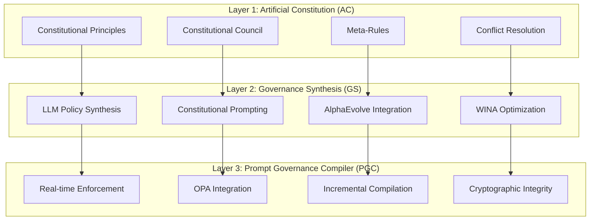
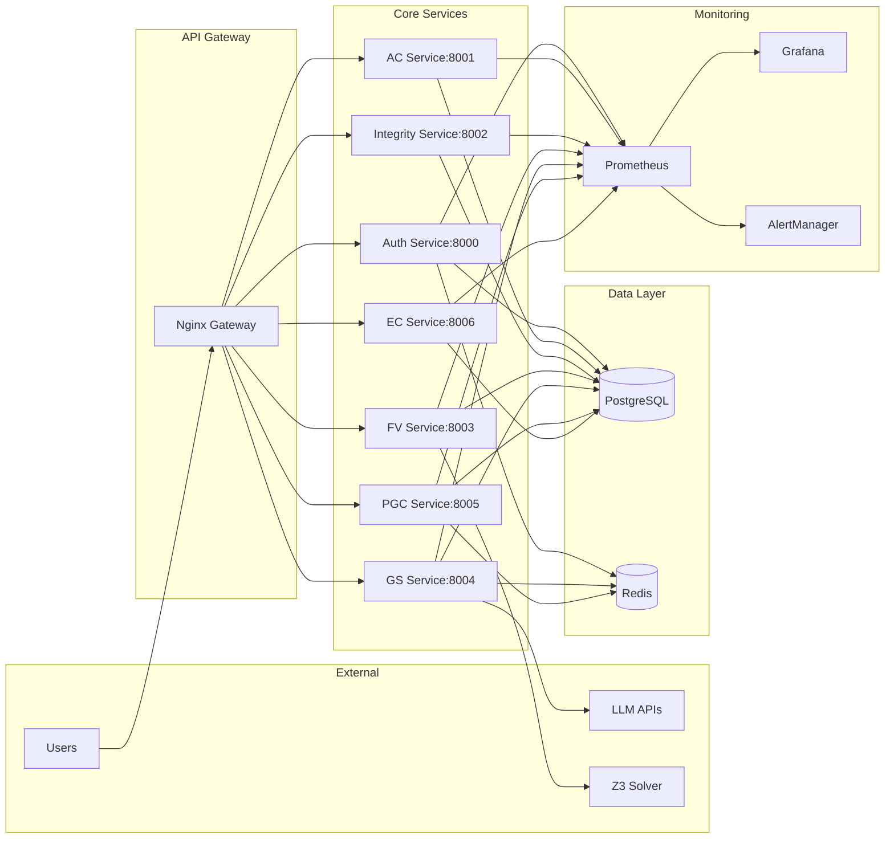
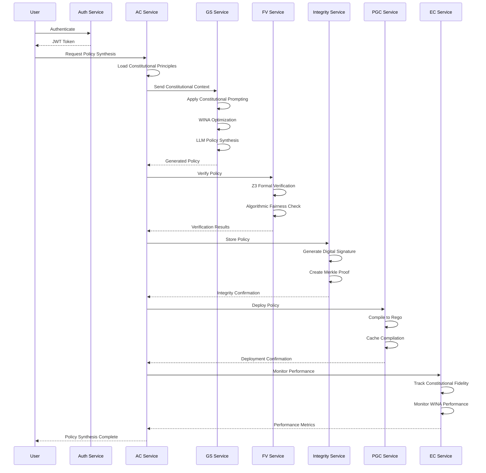
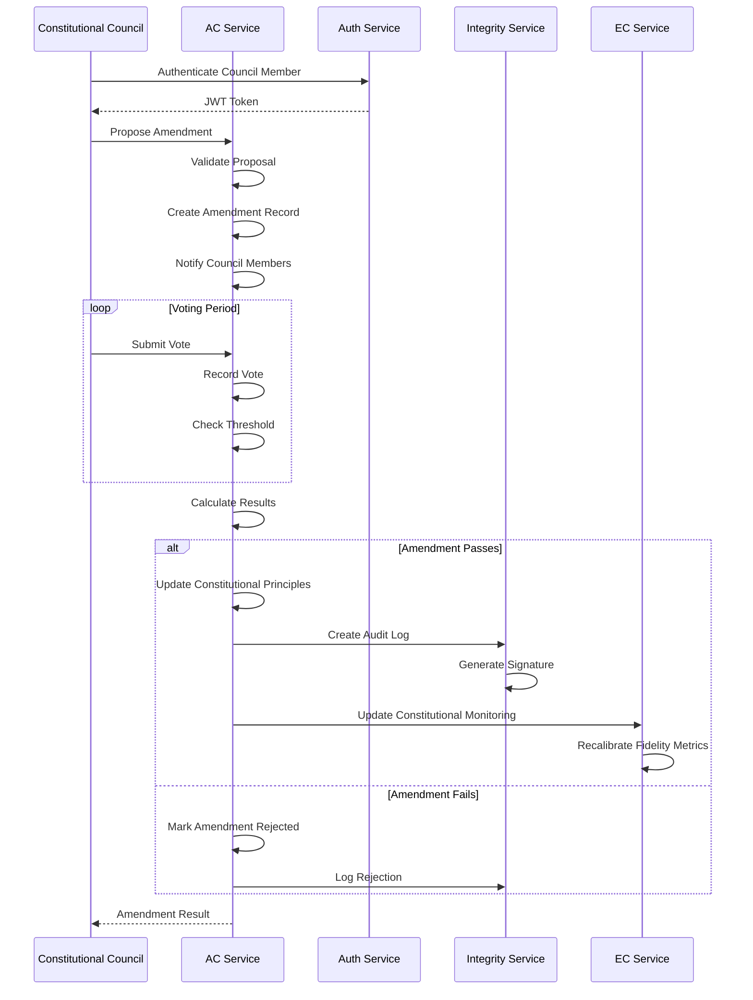

# ACGS-PGP Architecture Documentation

## 🎯 Overview

The **ACGS-PGP (AI Compliance Governance System - Policy Generation Platform)** implements a constitutional AI governance framework with **three-layer architecture** designed for democratic oversight, formal verification, and real-time enforcement of AI policies.

## 🏗️ System Architecture

### **Three-Layer Constitutional Governance**



### **Microservices Architecture**



## 🔧 Service Specifications

### **Authentication Service (Port 8000)**
- **Purpose**: JWT authentication, RBAC, CSRF protection
- **Technology**: FastAPI, SQLAlchemy, JWT, bcrypt
- **Database**: PostgreSQL (users, roles, sessions)
- **Features**:
  - Multi-role support (Admin/Policy Manager/Auditor/Constitutional Council)
  - Rate limiting (100 req/min default, 10 req/min auth endpoints)
  - Session management with Redis
  - CSRF token generation and validation

### **AC Service (Port 8001)**
- **Purpose**: Constitutional principles, meta-rules, Constitutional Council
- **Technology**: FastAPI, SQLAlchemy, Pydantic v2.0+
- **Database**: PostgreSQL (principles, meta_rules, amendments, votes)
- **Features**:
  - Enhanced Principle Management with priority weighting
  - Constitutional Council with democratic amendment processes
  - QEC (Quality, Error, Correction) enhancements
  - Conflict resolution with intelligent patch suggestions

### **Integrity Service (Port 8002)**
- **Purpose**: Cryptographic integrity, PGP assurance, audit logs
- **Technology**: FastAPI, SQLAlchemy, PGP/GPG, SHA3-256
- **Database**: PostgreSQL (policies, audit_logs, appeals, signatures)
- **Features**:
  - Digital signatures with PGP/GPG
  - Merkle tree integrity verification
  - Appeals processing workflow
  - Audit trail with cryptographic proof

### **FV Service (Port 8003)**
- **Purpose**: Z3 SMT solver, algorithmic fairness, bias detection
- **Technology**: FastAPI, Z3 Python bindings, HuggingFace Fairness
- **Database**: PostgreSQL (verification_results, safety_properties)
- **Features**:
  - Parallel validation pipeline (60-70% latency reduction)
  - Safety property verification
  - Bias detection with fairness metrics
  - Formal verification with mathematical proofs

### **GS Service (Port 8004)**
- **Purpose**: LLM policy synthesis, constitutional prompting, WINA optimization
- **Technology**: FastAPI, OpenAI API, Groq, Gemini, WINA
- **Database**: PostgreSQL (synthesis_jobs, policy_templates)
- **Features**:
  - Multi-model LLM validation (>99.9% reliability target)
  - Constitutional prompting with AC integration
  - AlphaEvolve evolutionary computation
  - WINA optimization (40-70% GFLOPs reduction)

### **PGC Service (Port 8005)**
- **Purpose**: Real-time policy enforcement, OPA integration
- **Technology**: FastAPI, Open Policy Agent, Rego
- **Database**: PostgreSQL (enforcement_rules, compliance_logs)
- **Features**:
  - Sub-200ms latency enforcement
  - Incremental compilation with OPA
  - Real-time governance decisions
  - Policy caching with Redis

### **EC Service (Port 8006)**
- **Purpose**: WINA-optimized oversight, evolutionary computation governance
- **Technology**: FastAPI, WINA, AlphaEvolve, Constitutional monitoring
- **Database**: PostgreSQL (oversight_metrics, governance_evolution)
- **Features**:
  - WINA performance monitoring
  - Constitutional compliance verification
  - Evolutionary governance strategies
  - Performance optimization alerts

## 🗄️ Database Schema

### **Core Tables**

#### **Authentication Schema**
```sql
-- Users table
CREATE TABLE users (
    id UUID PRIMARY KEY DEFAULT gen_random_uuid(),
    email VARCHAR(255) UNIQUE NOT NULL,
    username VARCHAR(100) UNIQUE NOT NULL,
    full_name VARCHAR(255),
    hashed_password VARCHAR(255) NOT NULL,
    is_active BOOLEAN DEFAULT true,
    role VARCHAR(50) DEFAULT 'auditor',
    created_at TIMESTAMP DEFAULT CURRENT_TIMESTAMP,
    updated_at TIMESTAMP DEFAULT CURRENT_TIMESTAMP
);

-- Sessions table
CREATE TABLE user_sessions (
    id UUID PRIMARY KEY DEFAULT gen_random_uuid(),
    user_id UUID REFERENCES users(id) ON DELETE CASCADE,
    session_token VARCHAR(255) UNIQUE NOT NULL,
    expires_at TIMESTAMP NOT NULL,
    created_at TIMESTAMP DEFAULT CURRENT_TIMESTAMP
);
```

#### **AC Schema (Enhanced)**
```sql
-- Constitutional Principles (Enhanced)
CREATE TABLE constitutional_principles (
    id UUID PRIMARY KEY DEFAULT gen_random_uuid(),
    name VARCHAR(255) NOT NULL,
    description TEXT,
    priority_weight DECIMAL(3,2) DEFAULT 1.0,
    scope VARCHAR(100) DEFAULT 'general',
    normative_statement TEXT,
    constraints JSONB,
    rationale TEXT,
    version INTEGER DEFAULT 1,
    is_active BOOLEAN DEFAULT true,
    created_at TIMESTAMP DEFAULT CURRENT_TIMESTAMP,
    updated_at TIMESTAMP DEFAULT CURRENT_TIMESTAMP
);

-- Meta-Rules
CREATE TABLE meta_rules (
    id UUID PRIMARY KEY DEFAULT gen_random_uuid(),
    name VARCHAR(255) NOT NULL,
    description TEXT,
    rule_type VARCHAR(50),
    priority INTEGER DEFAULT 0,
    conditions JSONB,
    actions JSONB,
    is_active BOOLEAN DEFAULT true,
    created_at TIMESTAMP DEFAULT CURRENT_TIMESTAMP
);

-- Constitutional Council
CREATE TABLE constitutional_amendments (
    id UUID PRIMARY KEY DEFAULT gen_random_uuid(),
    title VARCHAR(255) NOT NULL,
    description TEXT,
    proposed_changes JSONB,
    proposer_id UUID REFERENCES users(id),
    status VARCHAR(50) DEFAULT 'proposed',
    voting_deadline TIMESTAMP,
    created_at TIMESTAMP DEFAULT CURRENT_TIMESTAMP
);

-- Amendment Votes
CREATE TABLE amendment_votes (
    id UUID PRIMARY KEY DEFAULT gen_random_uuid(),
    amendment_id UUID REFERENCES constitutional_amendments(id),
    voter_id UUID REFERENCES users(id),
    vote VARCHAR(20) NOT NULL,
    reasoning TEXT,
    created_at TIMESTAMP DEFAULT CURRENT_TIMESTAMP,
    UNIQUE(amendment_id, voter_id)
);

-- Conflict Resolution
CREATE TABLE conflict_resolutions (
    id UUID PRIMARY KEY DEFAULT gen_random_uuid(),
    principle_a_id UUID REFERENCES constitutional_principles(id),
    principle_b_id UUID REFERENCES constitutional_principles(id),
    conflict_type VARCHAR(100),
    resolution_strategy VARCHAR(100),
    patch_suggestions JSONB,
    status VARCHAR(50) DEFAULT 'pending',
    created_at TIMESTAMP DEFAULT CURRENT_TIMESTAMP
);
```

#### **Integrity Schema (PGP Assurance)**
```sql
-- Policies with Cryptographic Integrity
CREATE TABLE policies (
    id UUID PRIMARY KEY DEFAULT gen_random_uuid(),
    name VARCHAR(255) NOT NULL,
    content TEXT NOT NULL,
    content_hash VARCHAR(64),
    digital_signature TEXT,
    merkle_root VARCHAR(64),
    version INTEGER DEFAULT 1,
    status VARCHAR(50) DEFAULT 'draft',
    created_by UUID REFERENCES users(id),
    created_at TIMESTAMP DEFAULT CURRENT_TIMESTAMP
);

-- Audit Logs with Cryptographic Proof
CREATE TABLE audit_logs (
    id UUID PRIMARY KEY DEFAULT gen_random_uuid(),
    entity_type VARCHAR(100) NOT NULL,
    entity_id UUID NOT NULL,
    action VARCHAR(100) NOT NULL,
    changes JSONB,
    user_id UUID REFERENCES users(id),
    signature TEXT,
    merkle_proof JSONB,
    created_at TIMESTAMP DEFAULT CURRENT_TIMESTAMP
);

-- Appeals Processing
CREATE TABLE appeals (
    id UUID PRIMARY KEY DEFAULT gen_random_uuid(),
    policy_id UUID REFERENCES policies(id),
    appellant_id UUID REFERENCES users(id),
    reason TEXT NOT NULL,
    evidence JSONB,
    status VARCHAR(50) DEFAULT 'submitted',
    resolution TEXT,
    resolved_by UUID REFERENCES users(id),
    created_at TIMESTAMP DEFAULT CURRENT_TIMESTAMP,
    resolved_at TIMESTAMP
);
```

#### **FV Schema (Formal Verification)**
```sql
-- Verification Results
CREATE TABLE verification_results (
    id UUID PRIMARY KEY DEFAULT gen_random_uuid(),
    policy_id UUID REFERENCES policies(id),
    verification_type VARCHAR(100),
    z3_formula TEXT,
    result VARCHAR(50),
    proof TEXT,
    counterexample JSONB,
    execution_time_ms INTEGER,
    created_at TIMESTAMP DEFAULT CURRENT_TIMESTAMP
);

-- Safety Properties
CREATE TABLE safety_properties (
    id UUID PRIMARY KEY DEFAULT gen_random_uuid(),
    name VARCHAR(255) NOT NULL,
    description TEXT,
    formal_specification TEXT,
    z3_encoding TEXT,
    is_active BOOLEAN DEFAULT true,
    created_at TIMESTAMP DEFAULT CURRENT_TIMESTAMP
);

-- Algorithmic Fairness Metrics
CREATE TABLE fairness_metrics (
    id UUID PRIMARY KEY DEFAULT gen_random_uuid(),
    policy_id UUID REFERENCES policies(id),
    metric_type VARCHAR(100),
    metric_value DECIMAL(10,6),
    threshold DECIMAL(10,6),
    passed BOOLEAN,
    details JSONB,
    created_at TIMESTAMP DEFAULT CURRENT_TIMESTAMP
);
```

#### **GS Schema (Governance Synthesis)**
```sql
-- LLM Synthesis Jobs
CREATE TABLE synthesis_jobs (
    id UUID PRIMARY KEY DEFAULT gen_random_uuid(),
    prompt TEXT NOT NULL,
    constitutional_context JSONB,
    llm_provider VARCHAR(50),
    llm_model VARCHAR(100),
    response TEXT,
    synthesis_quality DECIMAL(3,2),
    wina_optimization BOOLEAN DEFAULT false,
    gflops_reduction DECIMAL(3,2),
    created_at TIMESTAMP DEFAULT CURRENT_TIMESTAMP
);

-- AlphaEvolve Population
CREATE TABLE alphaevolve_population (
    id UUID PRIMARY KEY DEFAULT gen_random_uuid(),
    generation INTEGER,
    individual_id VARCHAR(100),
    genome JSONB,
    fitness_score DECIMAL(10,6),
    parent_ids JSONB,
    mutation_rate DECIMAL(3,2),
    created_at TIMESTAMP DEFAULT CURRENT_TIMESTAMP
);

-- WINA Performance Metrics
CREATE TABLE wina_metrics (
    id UUID PRIMARY KEY DEFAULT gen_random_uuid(),
    job_id UUID REFERENCES synthesis_jobs(id),
    original_gflops BIGINT,
    optimized_gflops BIGINT,
    reduction_percentage DECIMAL(5,2),
    synthesis_accuracy DECIMAL(5,4),
    constitutional_compliance DECIMAL(5,4),
    created_at TIMESTAMP DEFAULT CURRENT_TIMESTAMP
);
```

#### **PGC Schema (Policy Enforcement)**
```sql
-- Enforcement Rules
CREATE TABLE enforcement_rules (
    id UUID PRIMARY KEY DEFAULT gen_random_uuid(),
    name VARCHAR(255) NOT NULL,
    rego_policy TEXT NOT NULL,
    priority INTEGER DEFAULT 0,
    is_active BOOLEAN DEFAULT true,
    compilation_cache TEXT,
    cache_expires_at TIMESTAMP,
    created_at TIMESTAMP DEFAULT CURRENT_TIMESTAMP
);

-- Compliance Logs
CREATE TABLE compliance_logs (
    id UUID PRIMARY KEY DEFAULT gen_random_uuid(),
    rule_id UUID REFERENCES enforcement_rules(id),
    request_data JSONB,
    decision VARCHAR(50),
    reasoning TEXT,
    response_time_ms INTEGER,
    created_at TIMESTAMP DEFAULT CURRENT_TIMESTAMP
);
```

#### **EC Schema (Evolutionary Computation)**
```sql
-- Oversight Metrics
CREATE TABLE oversight_metrics (
    id UUID PRIMARY KEY DEFAULT gen_random_uuid(),
    metric_type VARCHAR(100),
    metric_value DECIMAL(10,6),
    constitutional_fidelity DECIMAL(5,4),
    performance_impact DECIMAL(5,4),
    alert_threshold DECIMAL(5,4),
    status VARCHAR(50),
    created_at TIMESTAMP DEFAULT CURRENT_TIMESTAMP
);

-- Governance Evolution
CREATE TABLE governance_evolution (
    id UUID PRIMARY KEY DEFAULT gen_random_uuid(),
    strategy_name VARCHAR(255),
    evolution_parameters JSONB,
    fitness_metrics JSONB,
    constitutional_compliance DECIMAL(5,4),
    performance_metrics JSONB,
    generation INTEGER,
    created_at TIMESTAMP DEFAULT CURRENT_TIMESTAMP
);

-- QEC Enhancement Tracking
CREATE TABLE qec_enhancements (
    id UUID PRIMARY KEY DEFAULT gen_random_uuid(),
    component VARCHAR(100),
    enhancement_type VARCHAR(100),
    fidelity_score DECIMAL(5,4),
    error_rate DECIMAL(5,4),
    correction_success_rate DECIMAL(5,4),
    constitutional_distance DECIMAL(5,4),
    created_at TIMESTAMP DEFAULT CURRENT_TIMESTAMP
);
```

## 🔄 Data Flow Architecture

### **Policy Synthesis Pipeline**


### **Constitutional Amendment Workflow**


## 🔧 Integration Patterns

### **Inter-Service Communication**
- **Synchronous**: HTTP/REST APIs with JWT authentication
- **Asynchronous**: Redis pub/sub for event-driven updates
- **Service Discovery**: Docker Compose DNS / Kubernetes service discovery
- **Circuit Breaker**: Implemented in each service for resilience
- **Retry Logic**: Exponential backoff with jitter

### **Database Integration**
- **Connection Pooling**: SQLAlchemy with asyncpg driver
- **Migration Management**: Alembic for schema versioning
- **Transaction Management**: ACID compliance with rollback support
- **Read Replicas**: Supported for high-availability deployments

### **External API Integration**
- **LLM APIs**: OpenAI, Groq, Gemini with fallback strategies
- **Z3 Solver**: Local binary integration with timeout handling
- **OPA**: HTTP API integration for policy evaluation
- **Monitoring**: Prometheus metrics collection

## 📊 Performance Characteristics

### **Latency Targets**
- **Authentication**: <50ms (95th percentile)
- **Policy Synthesis**: <5s (including LLM call)
- **Formal Verification**: <2s (simple policies), <30s (complex)
- **Policy Enforcement**: <200ms (95th percentile)
- **Constitutional Queries**: <100ms (95th percentile)

### **Throughput Targets**
- **Authentication**: 1000 req/s
- **Policy Operations**: 100 req/s
- **Verification Jobs**: 50 concurrent
- **Enforcement Decisions**: 500 req/s

### **Scalability**
- **Horizontal Scaling**: All services support multiple instances
- **Database Scaling**: Read replicas, connection pooling
- **Caching**: Redis for session management and policy caching
- **Load Balancing**: Nginx with least-connection algorithm

## 🔒 Security Architecture

### **Authentication & Authorization**
- **JWT Tokens**: HS256 algorithm with 15-minute expiry
- **Refresh Tokens**: 7-day expiry with rotation
- **RBAC**: Role-based access control with fine-grained permissions
- **CSRF Protection**: Token-based protection for state-changing operations

### **Data Protection**
- **Encryption at Rest**: PostgreSQL with TDE (Transparent Data Encryption)
- **Encryption in Transit**: TLS 1.3 for all communications
- **PGP Signatures**: Digital signatures for policy integrity
- **Merkle Trees**: Cryptographic proof of data integrity

### **Network Security**
- **API Gateway**: Nginx with rate limiting and DDoS protection
- **Firewall**: UFW with restrictive rules
- **VPN Access**: Required for administrative operations
- **SSL/TLS**: Let's Encrypt certificates with automatic renewal

## 🎯 Quality Attributes

### **Reliability**
- **Uptime Target**: >99.5%
- **Error Rate**: <5%
- **MTTR**: <30 minutes
- **Backup Strategy**: Daily automated backups with 30-day retention

### **Performance**
- **Response Time**: <200ms (95th percentile)
- **Throughput**: 100+ concurrent users
- **Resource Usage**: <80% CPU/Memory under normal load
- **Scalability**: Linear scaling up to 1000 concurrent users

### **Security**
- **Vulnerability Scanning**: Weekly automated scans
- **Penetration Testing**: Quarterly professional assessments
- **Compliance**: SOC 2 Type II, GDPR compliance
- **Incident Response**: <1 hour detection, <4 hour resolution

### **Maintainability**
- **Code Coverage**: >95% test coverage
- **Documentation**: Comprehensive API and architecture docs
- **Monitoring**: Real-time metrics and alerting
- **Deployment**: Automated CI/CD with rollback capability

---

**Last Updated**: January 2024  
**Version**: 1.0.0  
**Maintainer**: ACGS-PGP Architecture Team
