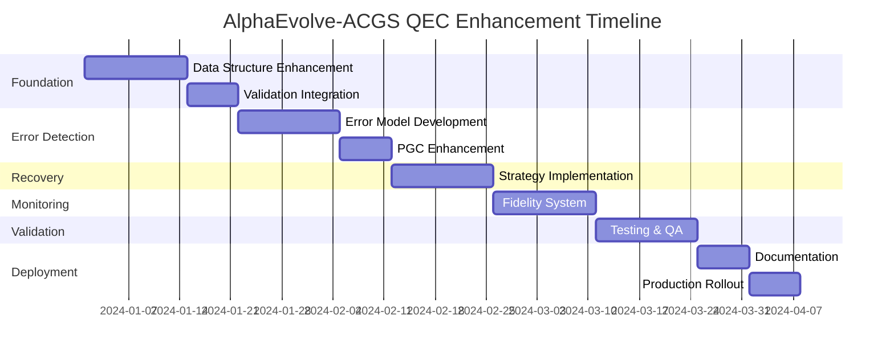

# AlphaEvolve-ACGS QEC-Inspired Enhancement Implementation Guide

## Project Overview

This implementation guide provides comprehensive instructions for integrating Quantum Error Correction (QEC) inspired enhancements into the AlphaEvolve-ACGS framework. The enhancements focus on improving constitutional principle resilience, error detection capabilities, recovery mechanisms, and overall system health monitoring.

## Project Structure & Organization

```
alphaevolve-acgs-qec-enhancement/
├── documentation/
│   ├── implementation-guide.md
│   ├── principle-authoring-guide.md
│   ├── error-taxonomy.md
│   └── api-specifications/
├── src/
│   ├── core/
│   │   ├── constitutional_principles/
│   │   │   ├── dataclasses/
│   │   │   ├── validation/
│   │   │   └── scoring/
│   │   ├── gs_engine/
│   │   │   ├── synthesis/
│   │   │   ├── error_detection/
│   │   │   └── recovery/
│   │   └── pgc/
│   │       ├── enforcement/
│   │       └── explanations/
│   ├── monitoring/
│   │   ├── fidelity_service/
│   │   └── dashboards/
│   └── ml_models/
│       └── error_classifier/
├── tests/
│   ├── unit/
│   ├── integration/
│   └── e2e/
├── config/
│   ├── feature_flags.yaml
│   ├── error_to_strategy_map.yaml
│   ├── thresholds.yaml
│   └── monitoring_weights.yaml
└── deployment/
    ├── staging/
    └── production/
```

## Detailed Implementation Tasks

### Phase 1: Foundation Enhancement (Weeks 1-3)

#### Task 1.1: Enhance Constitutional Principle Data Structure
**Objective**: Implement structured validation criteria and scoring mechanisms

**Detailed Instructions**:

1. **Update ConstitutionalPrinciple Dataclass**
   ```python
   # File: src/core/constitutional_principles/dataclasses/principle.py
   
   from dataclasses import dataclass, field
   from typing import List, Dict, Optional, Any
   from datetime import datetime
   
   @dataclass
   class ConstitutionalPrinciple:
       # Existing fields...
       id: str
       name: str
       description: str
       priority: int
       
       # New fields for QEC enhancement
       schema_version: int = 1
       validation_criteria_structured: List[str] = field(default_factory=list)
       constitutional_distance_score: float = 0.0
       score_last_updated: datetime = field(default_factory=datetime.now)
       score_calculation_metadata: Dict[str, Any] = field(default_factory=dict)
   ```

2. **Implement DSL Parser**
   ```python
   # File: src/core/constitutional_principles/validation/dsl_parser.py
   
   class ValidationCriteriaDSLParser:
       """
       Parses structured validation criteria using lightweight DSL.
       
       Grammar:
       [Scenario ID: <ID>]
       GIVEN: <context>
       WHEN: <action>
       THEN: <expected_outcome>
       """
       
       def __init__(self):
           self.grammar = self._load_grammar()
           self.linter = DSLLinter()
       
       def parse(self, criteria_text: str) -> Dict[str, Any]:
           """Parse DSL text into structured format"""
           # Implementation details...
           
       def generate_test_suite(self, parsed_criteria: Dict) -> TestSuite:
           """Generate automated tests from parsed criteria"""
           # Implementation details...
   ```

3. **Create Scoring Function**
   ```python
   # File: src/core/constitutional_principles/scoring/distance_calculator.py
   
   class ConstitutionalDistanceCalculator:
       """
       Calculates robustness score for constitutional principles.
       """
       
       def __init__(self, config_path: str):
           self.config = self._load_config(config_path)
           self.nlp_metrics = NLPMetricsCalculator()
           
       def calculate_score(self, principle: ConstitutionalPrinciple) -> float:
           """
           Calculate constitutional distance score.
           
           Components:
           - Language ambiguity (0-1): BERT perplexity normalized
           - Criteria formality (0-1): Based on structured criteria completeness
           - Synthesis reliability (0-1): Historical success rate
           """
           # Implementation details...
   ```

#### Task 1.2: Integrate Validation Pipeline
**Objective**: Modify existing validation to use structured criteria

**Detailed Instructions**:

1. **Update Semantic Validation Function**
   ```python
   # File: src/core/gs_engine/synthesis/validation.py
   
   def perform_semantic_validation_enhanced(
       rego_code: str, 
       principle: ConstitutionalPrinciple, 
       explanation: str
   ) -> ValidationResult:
       """Enhanced semantic validation using structured criteria"""
       
       # Parse structured criteria
       parser = ValidationCriteriaDSLParser()
       test_suite = parser.generate_test_suite(principle.validation_criteria_structured)
       
       # Run automated tests
       test_results = test_suite.execute(rego_code)
       
       # Fallback to LLM-as-judge for complex cases
       if test_results.requires_llm_validation:
           llm_result = perform_llm_validation(rego_code, principle, explanation)
           test_results.merge(llm_result)
       
       return test_results
   ```

2. **Create Review Trigger System**
   ```python
   # File: src/core/gs_engine/synthesis/review_triggers.py
   
   class ReviewTriggerManager:
       """Manages review triggers based on constitutional distance scores"""
       
       def __init__(self, config_path: str):
           self.thresholds = self._load_thresholds(config_path)
           
       def evaluate_review_requirements(self, principle: ConstitutionalPrinciple) -> ReviewRequirement:
           """Determine review requirements based on score"""
           if principle.constitutional_distance_score < self.thresholds['critical']:
               return ReviewRequirement.MANDATORY_HUMAN
           elif principle.constitutional_distance_score < self.thresholds['warning']:
               return ReviewRequirement.SECONDARY_LLM
           return ReviewRequirement.NONE
   ```

### Phase 2: Error Detection Enhancement (Weeks 4-6)

#### Task 2.1: Implement Learning-Based Error Model
**Objective**: Build ML model for LLM failure prediction

**Detailed Instructions**:

1. **Enhanced Failure Logging**
   ```python
   # File: src/core/gs_engine/error_detection/logging.py
   
   class SynthesisFailureLogger:
       """Enhanced logging for synthesis failures"""
       
       ERROR_TAXONOMY = {
           'SYNTAX_ERROR': 'Rego syntax validation failed',
           'SEMANTIC_CONFLICT': 'Generated rule conflicts with principle intent',
           'SAFETY_VIOLATION': 'Rule violates safety constraints',
           'BIAS_DETECTED': 'Potential bias in generated policy',
           'RULE_CONFLICT': 'Conflicts with existing rules',
           'TIMEOUT': 'Synthesis exceeded time limit',
           'LLM_ERROR': 'LLM API or response error'
       }
       
       def log_failure(self, 
                      synthesis_attempt_id: str,
                      principle: ConstitutionalPrinciple,
                      failure_type: str,
                      details: Dict[str, Any]) -> None:
           """Log structured failure information"""
           failure_record = {
               'synthesis_attempt_id': synthesis_attempt_id,
               'timestamp': datetime.now().isoformat(),
               'principle_id': principle.id,
               'principle_text': principle.description,
               'failure_type': failure_type,
               'failure_description': self.ERROR_TAXONOMY.get(failure_type, 'Unknown'),
               'details': details,
               'gs_engine_version': self.get_engine_version()
           }
           # Log to structured storage
   ```

2. **Build Error Classifier**
   ```python
   # File: src/ml_models/error_classifier/model.py
   
   class LLMErrorClassifier:
       """RoBERTa-based classifier for predicting LLM synthesis failures"""
       
       def __init__(self, model_path: str):
           self.model = self._load_model(model_path)
           self.preprocessor = TextPreprocessor()
           
       def predict(self, principle_text: str) -> PredictionResult:
           """Predict likely failure modes for principle"""
           processed_text = self.preprocessor.process(principle_text)
           predictions = self.model.predict(processed_text)
           
           return PredictionResult(
               predicted_failures=predictions['labels'],
               confidence_scores=predictions['scores']
           )
       
       def train(self, dataset_path: str, split_strategy: str = 'chronological'):
           """Train classifier on historical failure data"""
           # Implementation with chronological splitting
   ```

3. **Integrate Classifier into GS Engine**
   ```python
   # File: src/core/gs_engine/synthesis/engine.py
   
   class EnhancedGSEngine:
       """GS Engine with predictive error handling"""
       
       def __init__(self):
           self.error_classifier = LLMErrorClassifier('models/error_classifier.pkl')
           self.prompt_selector = DynamicPromptSelector()
           
       def synthesize_rule(self, principle: ConstitutionalPrinciple) -> OperationalRule:
           # Proactive error prediction
           prediction = self.error_classifier.predict(principle.description)
           
           # Select mitigation strategy
           prompt_template = self.prompt_selector.select_template(
               principle, 
               prediction.predicted_failures
           )
           
           # Attempt synthesis with selected strategy
           result = self._synthesize_with_strategy(principle, prompt_template)
           
           # Log actual vs predicted for continuous improvement
           if result.is_failure:
               self._log_prediction_accuracy(prediction, result.failure_type)
           
           return result
   ```

#### Task 2.2: Enhance PGC Explanations
**Objective**: Improve explainability of enforcement decisions

**Detailed Instructions**:

1. **Update Violation Data Structure**
   ```python
   # File: src/core/pgc/enforcement/violations.py
   
   @dataclass
   class ViolationDetail:
       """Detailed violation information for enhanced explanations"""
       principle_id: str
       principle_name: str
       principle_description: str
       validation_criteria: str
       rule_fragment: str  # Specific Rego that failed
       violation_context: Dict[str, Any]
       suggested_remediation: Optional[str] = None
   ```

2. **Enhance PGC Decision Engine**
   ```python
   # File: src/core/pgc/enforcement/decision_engine.py
   
   class EnhancedDecisionEngine:
       """PGC decision engine with rich explanations"""
       
       def validate_proposal(self, proposal: Any, active_rules: List[OperationalRule]) -> DecisionResult:
           # Existing validation logic...
           
           if violations:
               # Enrich violation details
               enriched_violations = []
               for violation in violations:
                   principle = self._fetch_principle(violation.principle_id)
                   enriched = ViolationDetail(
                       principle_id=principle.id,
                       principle_name=principle.name,
                       principle_description=principle.description,
                       validation_criteria=principle.validation_criteria_nl,
                       rule_fragment=violation.rule_fragment,
                       violation_context=self._extract_context(violation),
                       suggested_remediation=self._generate_remediation(violation)
                   )
                   enriched_violations.append(enriched)
               
               return DecisionResult(
                   decision='DENY',
                   violations=enriched_violations,
                   metadata=self._generate_metadata()
               )
   ```

3. **Update Dashboard Interface**
   ```javascript
   // File: src/monitoring/dashboards/explainability/components/ViolationDisplay.jsx
   
   const ViolationDisplay = ({ violation }) => {
     const [showDetails, setShowDetails] = useState(false);
     
     return (
       <div className="violation-container">
         <div className="violation-summary">
           <span className="violation-type">DENY</span>
           <span className="principle-name">{violation.principleName}</span>
           <button onClick={() => setShowDetails(!showDetails)}>
             {showDetails ? 'Hide Details' : 'Show Details'}
           </button>
         </div>
         
         {showDetails && (
           <div className="violation-details">
             <div className="principle-section">
               <h4>Violated Principle</h4>
               <p>{violation.principleDescription}</p>
               <div className="validation-criteria">
                 <h5>Original Criteria</h5>
                 <pre>{violation.validationCriteria}</pre>
               </div>
             </div>
             
             <div className="rule-section">
               <h4>Failed Rule Fragment</h4>
               <CodeHighlight language="rego">
                 {violation.ruleFragment}
               </CodeHighlight>
             </div>
             
             {violation.suggestedRemediation && (
               <div className="remediation-section">
                 <h4>Suggested Fix</h4>
                 <p>{violation.suggestedRemediation}</p>
               </div>
             )}
           </div>
         )}
       </div>
     );
   };
   ```

### Phase 3: Error Correction Optimization (Weeks 7-8)

#### Task 3.1: Implement Targeted Re-synthesis
**Objective**: Create intelligent recovery strategies

**Detailed Instructions**:

1. **Create Error-to-Strategy Mapping**
   ```yaml
   # File: config/error_to_strategy_map.yaml
   
   version: 1.0
   strategies:
     SYNTAX_ERROR:
       name: "Syntax Correction"
       approach: "template_guided"
       parameters:
         template: "syntax_correction_v1"
         max_attempts: 2
       
     SEMANTIC_CONFLICT:
       name: "Semantic Alignment"
       approach: "decomposition"
       parameters:
         granularity: "fine"
         context_enhancement: true
         
     SAFETY_VIOLATION:
       name: "Safety Constraint Enforcement"
       approach: "constraint_injection"
       parameters:
         constraint_level: "strict"
         
     BIAS_DETECTED:
       name: "Bias Mitigation"
       approach: "fairness_augmentation"
       parameters:
         fairness_metrics: ["demographic_parity", "equalized_odds"]
         
     RULE_CONFLICT:
       name: "Conflict Resolution"
       approach: "priority_based"
       parameters:
         resolution_strategy: "hierarchical"
   ```

2. **Implement Recovery Dispatcher**
   ```python
   # File: src/core/gs_engine/recovery/dispatcher.py
   
   class RecoveryDispatcher:
       """Intelligent recovery strategy dispatcher"""
       
       def __init__(self, config_path: str):
           self.strategies = self._load_strategies(config_path)
           self.metrics_tracker = RecoveryMetricsTracker()
           
       def dispatch_recovery(self, 
                           principle: ConstitutionalPrinciple, 
                           failure: SynthesisFailure,
                           attempt_count: int) -> RecoveryStrategy:
           """Select and execute appropriate recovery strategy"""
           
           if attempt_count >= self.MAX_ATTEMPTS:
               return EscalateToHumanStrategy()
           
           strategy_config = self.strategies.get(failure.type)
           if not strategy_config:
               return DefaultRecoveryStrategy()
           
           strategy = self._instantiate_strategy(strategy_config)
           
           # Track for effectiveness analysis
           self.metrics_tracker.record_dispatch(
               failure_type=failure.type,
               strategy_name=strategy_config['name'],
               attempt_number=attempt_count
           )
           
           return strategy
   ```

3. **Implement Recovery Strategies**
   ```python
   # File: src/core/gs_engine/recovery/strategies.py
   
   class TemplateGuidedRecovery(RecoveryStrategy):
       """Recovery using verified templates"""
       
       def execute(self, principle: ConstitutionalPrinciple, failure: SynthesisFailure) -> SynthesisResult:
           template = self._select_template(principle, failure)
           
           # Inject principle specifics into template
           customized_template = self._customize_template(template, principle)
           
           # Attempt synthesis with template
           return self._synthesize_with_template(customized_template)
   
   class DecompositionRecovery(RecoveryStrategy):
       """Recovery through principle decomposition"""
       
       def execute(self, principle: ConstitutionalPrinciple, failure: SynthesisFailure) -> SynthesisResult:
           # Decompose complex principle
           sub_principles = self._decompose_principle(principle)
           
           # Synthesize rules for each sub-principle
           sub_rules = []
           for sub_principle in sub_principles:
               result = self._synthesize_sub_rule(sub_principle)
               if result.is_success:
                   sub_rules.append(result.rule)
           
           # Combine sub-rules
           return self._combine_rules(sub_rules)
   ```

### Phase 4: System Health Monitoring (Weeks 9-10)

#### Task 4.1: Implement Constitutional Fidelity Metric
**Objective**: Create holistic system health monitoring

**Detailed Instructions**:

1. **Create Fidelity Calculation Service**
   ```python
   # File: src/monitoring/fidelity_service/calculator.py
   
   class ConstitutionalFidelityCalculator:
       """Calculates overall system health metric"""
       
       def __init__(self, config_path: str):
           self.weights = self._load_weights(config_path)
           self.data_sources = self._initialize_data_sources()
           
       def calculate_fidelity(self) -> FidelityScore:
           """Calculate current constitutional fidelity"""
           
           components = {
               'synthesis_success_rate': self._get_synthesis_success_rate(),
               'enforcement_accuracy': self._get_enforcement_accuracy(),
               'adaptation_velocity': self._get_adaptation_velocity(),
               'stakeholder_satisfaction': self._get_stakeholder_satisfaction(),
               'principle_coverage': self._get_principle_coverage()
           }
           
           # Apply weights
           weighted_score = sum(
               self.weights[component] * value 
               for component, value in components.items()
           )
           
           # Apply appeal penalties
           appeal_penalty = self._calculate_appeal_penalty()
           final_score = max(0, weighted_score - appeal_penalty)
           
           return FidelityScore(
               value=final_score,
               components=components,
               timestamp=datetime.now(),
               trend=self._calculate_trend()
           )
   ```

2. **Integrate Appeal Severity**
   ```python
   # File: src/core/governance/appeal_workflow.py
   
   class EnhancedAppealWorkflow:
       """Appeal workflow with severity scoring"""
       
       def submit_appeal(self, appeal: Appeal) -> AppealResult:
           # Existing appeal logic...
           
           # Calculate severity
           severity = self._calculate_severity(appeal)
           appeal.severity = severity
           
           # Notify fidelity service for high-severity appeals
           if severity == Severity.HIGH:
               self.fidelity_service.apply_appeal_penalty(
                   severity=severity,
                   appeal_id=appeal.id,
                   duration_hours=24  # Temporary penalty
               )
           
           return self._process_appeal(appeal)
   ```

3. **Create Monitoring Dashboard**
   ```python
   # File: src/monitoring/dashboards/fidelity/api.py
   
   from fastapi import FastAPI, HTTPException
   from datetime import datetime, timedelta
   
   app = FastAPI()
   
   @app.get("/api/fidelity")
   async def get_fidelity_score(
       include_history: bool = False,
       days: int = 30
   ):
       """Get current fidelity score and optional history"""
       
       calculator = ConstitutionalFidelityCalculator('config/monitoring_weights.yaml')
       current_score = calculator.calculate_fidelity()
       
       response = {
           'current': {
               'score': current_score.value,
               'status': _get_status(current_score.value),
               'components': current_score.components,
               'timestamp': current_score.timestamp.isoformat()
           }
       }
       
       if include_history:
           history = calculator.get_historical_data(
               start_date=datetime.now() - timedelta(days=days)
           )
           response['history'] = history
           response['trend'] = _calculate_trend(history)
       
       return response
   
   def _get_status(score: float) -> str:
       """Determine status based on thresholds"""
       if score >= 0.8:
           return 'GREEN'
       elif score >= 0.6:
           return 'AMBER'
       else:
           return 'RED'
   ```

4. **Configure Alert System**
   ```python
   # File: src/monitoring/fidelity_service/alerts.py
   
   class FidelityAlertManager:
       """Manages alerts based on fidelity thresholds"""
       
       def __init__(self, config_path: str):
           self.thresholds = self._load_thresholds(config_path)
           self.notification_service = NotificationService()
           
       def evaluate_and_alert(self, fidelity_score: FidelityScore):
           """Evaluate score and trigger appropriate alerts"""
           
           status = self._determine_status(fidelity_score.value)
           
           if status == 'RED':
               self._handle_red_alert(fidelity_score)
           elif status == 'AMBER':
               self._handle_amber_alert(fidelity_score)
           
       def _handle_red_alert(self, score: FidelityScore):
           """Handle critical fidelity degradation"""
           
           # Notify all stakeholders immediately
           self.notification_service.send_critical_alert(
               recipients=self._get_council_members(),
               message=f"CRITICAL: Constitutional Fidelity at {score.value:.2f}",
               details=score.components
           )
           
           # Trigger automatic review
           self._trigger_constitutional_review()
           
           # Freeze new amendments
           self._freeze_amendments(duration_hours=72)
   ```

## Comprehensive Task List

### Pre-Implementation Tasks
- [ ] Set up development environment with feature flags
- [ ] Create staging environment mirroring production
- [ ] Initialize version control with branching strategy
- [ ] Set up CI/CD pipeline with automated testing

### Phase 1: Foundation Enhancement
- [ ] **Task 1.1.1**: Update ConstitutionalPrinciple dataclass
- [ ] **Task 1.1.2**: Implement DSL grammar and parser
- [ ] **Task 1.1.3**: Create DSL linter and validator
- [ ] **Task 1.1.4**: Implement test suite generator
- [ ] **Task 1.1.5**: Create constitutional distance calculator
- [ ] **Task 1.1.6**: Implement score audit logging
- [ ] **Task 1.2.1**: Modify semantic validation function
- [ ] **Task 1.2.2**: Create adapter for LLM-as-judge integration
- [ ] **Task 1.2.3**: Implement review trigger system
- [ ] **Task 1.2.4**: Update GS Engine workflow with triggers

### Phase 2: Error Detection Enhancement
- [ ] **Task 2.1.1**: Define error taxonomy documentation
- [ ] **Task 2.1.2**: Implement enhanced failure logging
- [ ] **Task 2.1.3**: Create dataset for classifier training
- [ ] **Task 2.1.4**: Build and train RoBERTa-based classifier
- [ ] **Task 2.1.5**: Implement chronological data splitting
- [ ] **Task 2.1.6**: Create prediction API for classifier
- [ ] **Task 2.1.7**: Integrate classifier with GS Engine
- [ ] **Task 2.1.8**: Implement dynamic prompt selection
- [ ] **Task 2.2.1**: Create ViolationDetail data structure
- [ ] **Task 2.2.2**: Enhance PGC decision engine
- [ ] **Task 2.2.3**: Implement remediation suggestion system
- [ ] **Task 2.2.4**: Update dashboard UI components
- [ ] **Task 2.2.5**: Create detail modal interface

### Phase 3: Error Correction Optimization
- [ ] **Task 3.1.1**: Design error-to-strategy mapping schema
- [ ] **Task 3.1.2**: Create configuration management system
- [ ] **Task 3.1.3**: Implement recovery dispatcher
- [ ] **Task 3.1.4**: Create recovery strategy base class
- [ ] **Task 3.1.5**: Implement template-guided recovery
- [ ] **Task 3.1.6**: Implement decomposition recovery
- [ ] **Task 3.1.7**: Implement constraint injection recovery
- [ ] **Task 3.1.8**: Create recovery metrics tracking
- [ ] **Task 3.1.9**: Implement effectiveness analysis

### Phase 4: System Health Monitoring
- [ ] **Task 4.1.1**: Design fidelity metric components
- [ ] **Task 4.1.2**: Create weight configuration system
- [ ] **Task 4.1.3**: Implement fidelity calculator service
- [ ] **Task 4.1.4**: Create data source integrations
- [ ] **Task 4.1.5**: Implement appeal severity scoring
- [ ] **Task 4.1.6**: Create penalty application system
- [ ] **Task 4.1.7**: Build fidelity API endpoints
- [ ] **Task 4.1.8**: Create monitoring dashboard UI
- [ ] **Task 4.1.9**: Implement alert management system
- [ ] **Task 4.1.10**: Configure notification integrations

### Phase 5: Testing and Validation
- [ ] **Task 5.1**: Create comprehensive unit test suite
- [ ] **Task 5.2**: Implement integration tests
- [ ] **Task 5.3**: Design end-to-end test scenarios
- [ ] **Task 5.4**: Conduct performance benchmarking
- [ ] **Task 5.5**: Execute security audit
- [ ] **Task 5.6**: Perform load testing
- [ ] **Task 5.7**: Validate all feature flags
- [ ] **Task 5.8**: Document test coverage

### Phase 6: Documentation and Training
- [ ] **Task 6.1**: Update developer documentation
- [ ] **Task 6.2**: Create principle authoring guide
- [ ] **Task 6.3**: Document error taxonomy
- [ ] **Task 6.4**: Create API documentation
- [ ] **Task 6.5**: Develop stakeholder training materials
- [ ] **Task 6.6**: Create video tutorials
- [ ] **Task 6.7**: Update system architecture diagrams

### Phase 7: Deployment and Monitoring
- [ ] **Task 7.1**: Deploy to staging environment
- [ ] **Task 7.2**: Conduct stakeholder acceptance testing
- [ ] **Task 7.3**: Create deployment runbook
- [ ] **Task 7.4**: Configure production monitoring
- [ ] **Task 7.5**: Execute phased production rollout
- [ ] **Task 7.6**: Monitor key performance indicators
- [ ] **Task 7.7**: Create post-deployment dashboard
- [ ] **Task 7.8**: Schedule retrospective meeting

## Risk Mitigation Strategies

### Technical Risks
1. **LLM API Reliability**
   - Mitigation: Implement circuit breakers and fallback models
   - Contingency: Local model deployment option

2. **Classifier Accuracy**
   - Mitigation: Continuous retraining pipeline
   - Contingency: Human review escalation

3. **Performance Degradation**
   - Mitigation: Comprehensive load testing and optimization
   - Contingency: Horizontal scaling preparation

### Organizational Risks
1. **Stakeholder Resistance**
   - Mitigation: Early engagement and training
   - Contingency: Phased adoption strategy

2. **Resource Constraints**
   - Mitigation: Prioritized feature implementation
   - Contingency: External expertise engagement

## Success Metrics

### Primary KPIs
- **First-Pass Synthesis Success Rate**: Target >85% (baseline: 78.6%)
- **Average Recovery Attempts**: Target <2.0 (baseline: 3.5)
- **Constitutional Fidelity Score**: Target >0.8 (GREEN status)
- **Mean Time to Resolution**: Target <48 hours for appeals

### Secondary Metrics
- Principle authoring time reduction
- Stakeholder satisfaction score
- System availability (>99.9%)
- Documentation completeness

## Project Timeline



## Conclusion

This implementation guide provides a comprehensive roadmap for enhancing the AlphaEvolve-ACGS framework with QEC-inspired improvements. The systematic approach ensures robust error detection, intelligent recovery mechanisms, and proactive system health monitoring while maintaining backward compatibility and operational stability.

The modular design allows for independent feature deployment and rollback, minimizing risk while maximizing the potential for iterative improvement. Success depends on careful execution of each phase, continuous monitoring of key metrics, and responsive adaptation based on stakeholder feedback and system performance data.