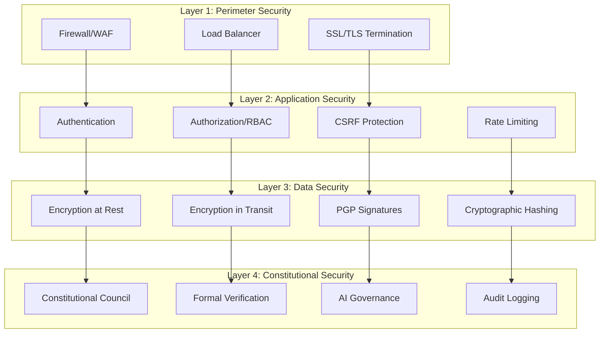

# ACGS-PGP Security Documentation

## 🛡️ Overview

This document outlines the comprehensive security architecture and implementation for the **ACGS-PGP (AI Compliance Governance System - Policy Generation Platform)**. The system implements defense-in-depth security with constitutional AI governance, cryptographic integrity, and formal verification.

## 🔐 Security Architecture

### **Multi-Layer Security Model**



## 🔑 Authentication & Authorization

### **JWT Authentication**
```python
# JWT Configuration
AUTH_SERVICE_SECRET_KEY = "256-bit-cryptographically-secure-key"
AUTH_SERVICE_ALGORITHM = "HS256"
ACCESS_TOKEN_EXPIRE_MINUTES = 15
REFRESH_TOKEN_EXPIRE_DAYS = 7

# Token Structure
{
    "sub": "user_id",
    "email": "user@example.com",
    "role": "policy_manager",
    "permissions": ["read:policies", "write:policies"],
    "iat": 1640995200,
    "exp": 1640996100,
    "jti": "unique_token_id"
}
```

### **Role-Based Access Control (RBAC)**

#### **Role Definitions**
```yaml
roles:
  admin:
    description: "Full system administration access"
    permissions:
      - "*:*"  # All permissions
    
  policy_manager:
    description: "Policy creation and management"
    permissions:
      - "read:policies"
      - "write:policies"
      - "read:principles"
      - "write:principles"
      - "read:synthesis"
      - "write:synthesis"
    
  constitutional_council:
    description: "Constitutional amendment and oversight"
    permissions:
      - "read:principles"
      - "write:amendments"
      - "vote:amendments"
      - "read:constitutional_council"
    
  auditor:
    description: "Read-only access for auditing"
    permissions:
      - "read:policies"
      - "read:principles"
      - "read:audit_logs"
      - "read:verification_results"
```

#### **Permission Matrix**
| Resource | Admin | Policy Manager | Constitutional Council | Auditor |
|----------|-------|----------------|----------------------|---------|
| Policies | CRUD | CRUD | R | R |
| Principles | CRUD | CRUD | R | R |
| Amendments | CRUD | R | CRU | R |
| Votes | CRUD | R | CRU | R |
| Audit Logs | CRUD | R | R | R |
| Users | CRUD | - | - | - |
| System Config | CRUD | - | - | - |

### **CSRF Protection**
```python
# CSRF Token Generation
CSRF_SECRET_KEY = "256-bit-csrf-specific-key"
CSRF_TOKEN_EXPIRE_MINUTES = 60

# Implementation
@csrf_protect
async def create_policy(request: Request, policy: PolicyCreate):
    csrf_token = request.headers.get("X-CSRF-Token")
    if not validate_csrf_token(csrf_token, request.session):
        raise HTTPException(401, "Invalid CSRF token")
    # Process request...
```

## 🔒 Data Protection

### **Encryption at Rest**
```sql
-- PostgreSQL TDE Configuration
ALTER SYSTEM SET ssl = on;
ALTER SYSTEM SET ssl_cert_file = '/etc/ssl/certs/server.crt';
ALTER SYSTEM SET ssl_key_file = '/etc/ssl/private/server.key';
ALTER SYSTEM SET ssl_ca_file = '/etc/ssl/certs/ca.crt';

-- Column-level encryption for sensitive data
CREATE EXTENSION IF NOT EXISTS pgcrypto;

-- Encrypted password storage
CREATE TABLE users (
    id UUID PRIMARY KEY,
    email VARCHAR(255) UNIQUE NOT NULL,
    hashed_password VARCHAR(255) NOT NULL, -- bcrypt with salt
    encryption_key_id UUID REFERENCES encryption_keys(id)
);
```

### **Encryption in Transit**
```nginx
# Nginx SSL Configuration
server {
    listen 443 ssl http2;
    server_name api.acgs-pgp.example.com;
    
    # SSL Certificate Configuration
    ssl_certificate /etc/letsencrypt/live/api.acgs-pgp.example.com/fullchain.pem;
    ssl_certificate_key /etc/letsencrypt/live/api.acgs-pgp.example.com/privkey.pem;
    
    # SSL Security Configuration
    ssl_protocols TLSv1.2 TLSv1.3;
    ssl_ciphers ECDHE-RSA-AES256-GCM-SHA512:DHE-RSA-AES256-GCM-SHA512:ECDHE-RSA-AES256-GCM-SHA384;
    ssl_prefer_server_ciphers off;
    ssl_session_cache shared:SSL:10m;
    ssl_session_timeout 10m;
    
    # HSTS Header
    add_header Strict-Transport-Security "max-age=63072000; includeSubDomains; preload";
    
    # Security Headers
    add_header X-Frame-Options DENY;
    add_header X-Content-Type-Options nosniff;
    add_header X-XSS-Protection "1; mode=block";
    add_header Referrer-Policy "strict-origin-when-cross-origin";
    add_header Content-Security-Policy "default-src 'self'; script-src 'self' 'unsafe-inline'; style-src 'self' 'unsafe-inline'";
}
```

### **PGP Digital Signatures**
```python
# PGP Implementation for Policy Integrity
import gnupg

class PolicyIntegrityService:
    def __init__(self):
        self.gpg = gnupg.GPG(gnupghome='/app/.gnupg')
        
    async def sign_policy(self, policy_content: str, key_id: str) -> str:
        """Sign policy content with PGP key"""
        signed_data = self.gpg.sign(
            policy_content,
            keyid=key_id,
            passphrase=os.getenv('PGP_PASSPHRASE'),
            detach=True
        )
        return str(signed_data)
    
    async def verify_signature(self, content: str, signature: str) -> bool:
        """Verify PGP signature"""
        verified = self.gpg.verify_data(signature, content.encode())
        return verified.valid
    
    async def generate_merkle_proof(self, policy_id: str) -> dict:
        """Generate Merkle tree proof for policy integrity"""
        # Implementation of Merkle tree generation
        pass
```

### **Cryptographic Hashing**
```python
# SHA3-256 Implementation
import hashlib

def generate_policy_hash(policy_content: str) -> str:
    """Generate SHA3-256 hash of policy content"""
    return hashlib.sha3_256(policy_content.encode()).hexdigest()

def verify_policy_integrity(policy_content: str, stored_hash: str) -> bool:
    """Verify policy integrity using hash comparison"""
    computed_hash = generate_policy_hash(policy_content)
    return computed_hash == stored_hash

# Merkle Tree Implementation
class MerkleTree:
    def __init__(self, data_blocks: List[str]):
        self.leaves = [hashlib.sha3_256(block.encode()).hexdigest() for block in data_blocks]
        self.tree = self._build_tree()
    
    def _build_tree(self) -> List[List[str]]:
        """Build Merkle tree from leaves"""
        tree = [self.leaves]
        while len(tree[-1]) > 1:
            level = []
            current_level = tree[-1]
            for i in range(0, len(current_level), 2):
                left = current_level[i]
                right = current_level[i + 1] if i + 1 < len(current_level) else left
                combined = left + right
                level.append(hashlib.sha3_256(combined.encode()).hexdigest())
            tree.append(level)
        return tree
    
    def get_root(self) -> str:
        """Get Merkle root hash"""
        return self.tree[-1][0]
    
    def get_proof(self, index: int) -> List[dict]:
        """Generate Merkle proof for specific leaf"""
        proof = []
        for level_idx in range(len(self.tree) - 1):
            level = self.tree[level_idx]
            if index % 2 == 0:
                sibling_idx = index + 1
                position = "right"
            else:
                sibling_idx = index - 1
                position = "left"
            
            if sibling_idx < len(level):
                proof.append({
                    "hash": level[sibling_idx],
                    "position": position
                })
            
            index = index // 2
        
        return proof
```

## 🔍 Security Monitoring

### **Audit Logging**
```python
# Comprehensive Audit Logging
class AuditLogger:
    async def log_action(
        self,
        user_id: str,
        action: str,
        resource_type: str,
        resource_id: str,
        changes: dict = None,
        ip_address: str = None,
        user_agent: str = None
    ):
        audit_entry = AuditLog(
            id=uuid4(),
            user_id=user_id,
            action=action,
            resource_type=resource_type,
            resource_id=resource_id,
            changes=changes,
            ip_address=ip_address,
            user_agent=user_agent,
            timestamp=datetime.utcnow(),
            signature=self._generate_signature(audit_data)
        )
        
        await self.db.save(audit_entry)
        await self._send_to_siem(audit_entry)
    
    def _generate_signature(self, audit_data: dict) -> str:
        """Generate cryptographic signature for audit entry"""
        data_string = json.dumps(audit_data, sort_keys=True)
        return hmac.new(
            self.audit_key.encode(),
            data_string.encode(),
            hashlib.sha3_256
        ).hexdigest()
```

### **Intrusion Detection**
```python
# Rate Limiting and Anomaly Detection
class SecurityMonitor:
    def __init__(self):
        self.redis = Redis()
        self.alert_thresholds = {
            'failed_logins': 5,
            'api_requests': 100,
            'policy_changes': 10
        }
    
    async def check_rate_limit(self, user_id: str, action: str) -> bool:
        """Check if user has exceeded rate limits"""
        key = f"rate_limit:{user_id}:{action}"
        current_count = await self.redis.get(key) or 0
        
        if int(current_count) >= self.alert_thresholds.get(action, 100):
            await self._trigger_alert(f"Rate limit exceeded: {user_id} - {action}")
            return False
        
        await self.redis.incr(key)
        await self.redis.expire(key, 3600)  # 1 hour window
        return True
    
    async def detect_anomalies(self, user_id: str, action: str, metadata: dict):
        """Detect anomalous behavior patterns"""
        # Implement ML-based anomaly detection
        # Check for unusual access patterns, geographic anomalies, etc.
        pass
```

### **Vulnerability Scanning**
```yaml
# Security Scanning Configuration
security_scans:
  dependency_check:
    tool: "safety"
    schedule: "daily"
    config:
      - "safety check --json"
      - "bandit -r src/ -f json"
  
  container_scan:
    tool: "trivy"
    schedule: "on_build"
    config:
      - "trivy image --severity HIGH,CRITICAL acgs-pgp:latest"
  
  static_analysis:
    tool: "semgrep"
    schedule: "on_commit"
    config:
      - "semgrep --config=auto src/"
  
  dynamic_scan:
    tool: "zap"
    schedule: "weekly"
    config:
      - "zap-baseline.py -t https://api.acgs-pgp.example.com"
```

## 🛡️ Network Security

### **Firewall Configuration**
```bash
# UFW Firewall Rules
sudo ufw --force reset
sudo ufw default deny incoming
sudo ufw default allow outgoing

# SSH Access (restricted to admin network)
sudo ufw allow from 10.0.1.0/24 to any port 22

# HTTP/HTTPS (public access)
sudo ufw allow 80/tcp
sudo ufw allow 443/tcp

# Monitoring (restricted to monitoring network)
sudo ufw allow from 10.0.2.0/24 to any port 9090  # Prometheus
sudo ufw allow from 10.0.2.0/24 to any port 3001  # Grafana

# Database (internal only)
sudo ufw deny 5432/tcp

# Enable firewall
sudo ufw --force enable
```

### **DDoS Protection**
```nginx
# Nginx DDoS Protection
http {
    # Rate limiting
    limit_req_zone $binary_remote_addr zone=api:10m rate=10r/s;
    limit_req_zone $binary_remote_addr zone=auth:10m rate=5r/s;
    
    # Connection limiting
    limit_conn_zone $binary_remote_addr zone=conn_limit_per_ip:10m;
    
    server {
        # Apply rate limits
        location /api/ {
            limit_req zone=api burst=20 nodelay;
            limit_conn conn_limit_per_ip 10;
        }
        
        location /auth/ {
            limit_req zone=auth burst=5 nodelay;
            limit_conn conn_limit_per_ip 5;
        }
        
        # Block common attack patterns
        location ~* \.(php|asp|aspx|jsp)$ {
            return 444;
        }
        
        # Block SQL injection attempts
        if ($args ~* "(\;|\||\`|\'|\"|\$|\%|\<|\>|\^|\*|\?|\[|\]|\{|\}|\(|\)|=|!|&|#)") {
            return 444;
        }
    }
}
```

## 🔐 Constitutional Security

### **Constitutional Council Security**
```python
# Constitutional Council Access Control
class ConstitutionalCouncilSecurity:
    async def verify_council_member(self, user_id: str) -> bool:
        """Verify user is authorized Constitutional Council member"""
        user = await self.user_service.get_user(user_id)
        return user.role == "constitutional_council" and user.is_active
    
    async def validate_amendment_proposal(self, proposal: AmendmentProposal) -> bool:
        """Validate amendment proposal meets security requirements"""
        # Check proposal format and content
        if not self._validate_proposal_format(proposal):
            return False
        
        # Verify proposer authority
        if not await self.verify_council_member(proposal.proposer_id):
            return False
        
        # Check for malicious content
        if self._contains_malicious_content(proposal.description):
            return False
        
        return True
    
    async def secure_voting_process(self, amendment_id: str, vote: Vote) -> bool:
        """Ensure secure voting process"""
        # Verify voter eligibility
        if not await self.verify_council_member(vote.voter_id):
            return False
        
        # Check for duplicate votes
        existing_vote = await self.get_existing_vote(amendment_id, vote.voter_id)
        if existing_vote:
            return False
        
        # Validate vote within voting period
        amendment = await self.get_amendment(amendment_id)
        if datetime.utcnow() > amendment.voting_deadline:
            return False
        
        # Generate cryptographic proof of vote
        vote.signature = self._sign_vote(vote)
        
        return True
```

### **AI Governance Security**
```python
# LLM Security and Validation
class LLMSecurityService:
    def __init__(self):
        self.content_filter = ContentFilter()
        self.bias_detector = BiasDetector()
        
    async def validate_llm_response(self, prompt: str, response: str) -> dict:
        """Comprehensive LLM response validation"""
        validation_results = {
            "content_safe": False,
            "bias_free": False,
            "constitutional_compliant": False,
            "confidence_score": 0.0
        }
        
        # Content safety check
        validation_results["content_safe"] = await self.content_filter.is_safe(response)
        
        # Bias detection
        bias_score = await self.bias_detector.analyze(response)
        validation_results["bias_free"] = bias_score < 0.1
        
        # Constitutional compliance check
        compliance_score = await self._check_constitutional_compliance(response)
        validation_results["constitutional_compliant"] = compliance_score > 0.85
        
        # Overall confidence
        validation_results["confidence_score"] = min(
            validation_results["content_safe"] * 1.0,
            (1.0 - bias_score),
            compliance_score
        )
        
        return validation_results
    
    async def _check_constitutional_compliance(self, response: str) -> float:
        """Check response compliance with constitutional principles"""
        principles = await self.ac_service.get_active_principles()
        compliance_scores = []
        
        for principle in principles:
            score = await self._evaluate_principle_compliance(response, principle)
            weighted_score = score * principle.priority_weight
            compliance_scores.append(weighted_score)
        
        return sum(compliance_scores) / len(compliance_scores) if compliance_scores else 0.0
```

## 🚨 Incident Response

### **Security Incident Classification**
```yaml
incident_types:
  critical:
    - "Data breach"
    - "Unauthorized admin access"
    - "Constitutional principle tampering"
    - "Cryptographic key compromise"
    response_time: "15 minutes"
    
  high:
    - "Failed authentication spike"
    - "Unusual API access patterns"
    - "Policy integrity violation"
    - "Service availability impact"
    response_time: "1 hour"
    
  medium:
    - "Rate limit violations"
    - "Content filter triggers"
    - "Audit log anomalies"
    response_time: "4 hours"
    
  low:
    - "Failed login attempts"
    - "Minor configuration issues"
    - "Performance degradation"
    response_time: "24 hours"
```

### **Automated Response Actions**
```python
# Incident Response Automation
class IncidentResponseSystem:
    async def handle_security_incident(self, incident_type: str, severity: str, details: dict):
        """Automated incident response based on type and severity"""
        
        if severity == "critical":
            await self._critical_incident_response(incident_type, details)
        elif severity == "high":
            await self._high_incident_response(incident_type, details)
        
        # Log incident
        await self.audit_logger.log_security_incident(incident_type, severity, details)
        
        # Notify security team
        await self.notification_service.alert_security_team(incident_type, severity, details)
    
    async def _critical_incident_response(self, incident_type: str, details: dict):
        """Critical incident response actions"""
        if incident_type == "data_breach":
            # Immediate containment
            await self._isolate_affected_systems()
            await self._revoke_all_active_sessions()
            await self._enable_emergency_mode()
            
        elif incident_type == "unauthorized_admin_access":
            # Lock down admin functions
            await self._disable_admin_endpoints()
            await self._force_admin_re_authentication()
            
        elif incident_type == "constitutional_tampering":
            # Protect constitutional integrity
            await self._lock_constitutional_changes()
            await self._verify_constitutional_integrity()
            await self._notify_constitutional_council()
```

## 📋 Security Compliance

### **Compliance Frameworks**
- **SOC 2 Type II**: Security, availability, processing integrity
- **GDPR**: Data protection and privacy rights
- **ISO 27001**: Information security management
- **NIST Cybersecurity Framework**: Identify, protect, detect, respond, recover

### **Security Metrics**
```yaml
security_kpis:
  authentication:
    - metric: "Authentication success rate"
      target: ">95%"
      measurement: "Daily"
    
    - metric: "Failed login attempts"
      target: "<5% of total attempts"
      measurement: "Hourly"
  
  authorization:
    - metric: "Unauthorized access attempts"
      target: "0 successful attempts"
      measurement: "Real-time"
    
    - metric: "Privilege escalation attempts"
      target: "0 successful attempts"
      measurement: "Real-time"
  
  data_protection:
    - metric: "Data integrity violations"
      target: "0 violations"
      measurement: "Real-time"
    
    - metric: "Encryption coverage"
      target: "100% of sensitive data"
      measurement: "Weekly"
  
  incident_response:
    - metric: "Mean time to detection (MTTD)"
      target: "<15 minutes"
      measurement: "Per incident"
    
    - metric: "Mean time to response (MTTR)"
      target: "<1 hour for critical"
      measurement: "Per incident"
```

### **Security Testing Schedule**
```yaml
security_testing:
  penetration_testing:
    frequency: "Quarterly"
    scope: "Full application and infrastructure"
    provider: "External security firm"
  
  vulnerability_assessment:
    frequency: "Monthly"
    scope: "Application and dependencies"
    tools: ["OWASP ZAP", "Nessus", "Qualys"]
  
  code_security_review:
    frequency: "Per release"
    scope: "All code changes"
    tools: ["SonarQube", "Semgrep", "Bandit"]
  
  compliance_audit:
    frequency: "Annually"
    scope: "SOC 2, GDPR, ISO 27001"
    provider: "External auditor"
```

---

**Last Updated**: January 2024  
**Version**: 1.0.0  
**Classification**: Internal Use Only  
**Maintainer**: ACGS-PGP Security Team
